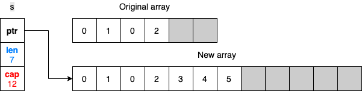

# Not understanding slice length and capacity


It’s pretty common for Go developers to mix slice length and capacity or not understand them thoroughly. Assimilating these two concepts is essential for efficiently handling core operations such as slice initialization and adding elements with append, copying, or slicing. This misunderstanding can lead to using slices suboptimally or even to memory leaks.

In Go, a slice is backed by an array. That means the slice’s data is stored contiguously in an array data structure. A slice also handles the logic of adding an element if the backing array is full or shrinking the backing array if it’s almost empty.

Internally, a slice holds a pointer to the backing array plus a length and a capacity. The length is the number of elements the slice contains, whereas the capacity is the number of elements in the backing array, counting from the first element in the slice. Let’s go through a few examples to make things clearer. First, let’s initialize a slice with a given length and capacity:

```go
s := make([]int, 3, 6) // Three-length, six-capacity slice
```

The first argument, representing the length, is mandatory. However, the second argument representing the capacity is optional. Figure 1 shows the result of this code in memory.

<figure markdown>
  
  <figcaption>Figure 1: A three-length, six-capacity slice.</figcaption>
</figure>

In this case, `make` creates an array of six elements (the capacity). But because the length was set to 3, Go initializes only the first three elements. Also, because the slice is an `[]int` type, the first three elements are initialized to the zeroed value of an `int`: 0. The grayed elements are allocated but not yet used.

If we print this slice, we get the elements within the range of the length, `[0 0 0]`. If we set `s[1]` to 1, the second element of the slice updates without impacting its length or capacity. Figure 2 illustrates this.

<figure markdown>
  
  <figcaption>Figure 2: Updating the slice’s second element: s[1] = 1.</figcaption>
</figure>

However, accessing an element outside the length range is forbidden, even though it’s already allocated in memory. For example, `s[4]` = 0 would lead to the following panic:

```
panic: runtime error: index out of range [4] with length 3
```

How can we use the remaining space of the slice? By using the `append` built-in function:

```go
s = append(s, 2)
```

This code appends to the existing `s` slice a new element. It uses the first grayed element (which was allocated but not yet used) to store element 2, as figure 3 shows.

<figure markdown>
  
  <figcaption>Figure 3: Appending an element to s.</figcaption>
</figure>

The length of the slice is updated from 3 to 4 because the slice now contains four elements. Now, what happens if we add three more elements so that the backing array isn’t large enough?

```go
s = append(s, 3, 4, 5)
fmt.Println(s)
```

If we run this code, we see that the slice was able to cope with our request:

```
[0 1 0 2 3 4 5]
```

Because an array is a fixed-size structure, we cannot fit all the new elements, since there isn’t enough space for element 5. Go detects this in advance, creates another array with doubled capacity, copies the existing elements, and inserts all the new ones. Figure 4 illustrates this process.

<figure markdown>
  
  <figcaption>Figure 4: Because the initial backing array is full, Go creates another array and copies all the elements.</figcaption>
</figure>

The slice now references the new backing array. What will happen to the previous backing array? If it’s no longer referenced, it’s eventually freed by the garbage collector (GC) if allocated on the heap. (We discuss heap memory in mistake #95, “[Not understanding stack vs. heap](https://100go.co#not-understanding-stack-vs-heap-95),” and we look at how the GC works in mistake #99, “[Not understanding how the GC works](https://100go.co#not-understanding-how-the-gc-works-99).”)

What happens with slicing? Slicing is an operation done on an array or a slice, providing a half-open range; the first index is included, whereas the second is excluded. The following example shows the impact, and figure 5 displays the result in memory:

```go
s1 := make([]int, 3, 6) // Three-length, six-capacity slice
s2 := s1[1:3] // Slicing from indices 1 to 3
```

<figure markdown>
  
  <figcaption>Figure 5: The slices s1 and s2 reference the same backing array with different lengths and capacities.</figcaption>
</figure>

First, `s1` is created as a three-length, six-capacity slice. When `s2` is created by slicing `s1`, both slices reference the same backing array. However, `s2` starts from a different index, 1. Therefore, its length and capacity (a two-length, five-capacity slice) differ from s1. If we update `s1[1]` or `s2[0]`, the change is made to the same array, hence, visible in both slices, as figure 6 shows.

<figure markdown>
  
  <figcaption>Figure 6: Because s1 and s2 are backed by the same array, updating a common element makes the change visible in both slices.</figcaption>
</figure>

Now, what happens if we append an element to `s2`? Does the following code change `s1` as well?

```go
s2 = append(s2, 2)
```

The shared backing array is modified, but only the length of `s2` changes. Figure 7 shows the result of appending an element to `s2`.

<figure markdown>
  
  <figcaption>Figure 7: Appending an element to s2.</figcaption>
</figure>

`s1` remains a three-length, six-capacity slice. Therefore, if we print `s1` and `s2`, the added element is only visible for `s2`:

```go
s1=[0 1 0], s2=[1 0 2]
```

It’s important to understand this behavior so that we don’t make wrong assumptions while using append.

???+ note

    In these examples, the backing array is internal and not available directly to the Go developer. The only exception is when a slice is created from slicing an existing array.

One last thing to note: what if we keep appending elements to `s2` until the backing array is full? What will the state be, memory-wise? Let’s add three more elements so that the backing array will not have enough capacity:

```go
s2 = append(s2, 3)
s2 = append(s2, 4) // At this stage, the backing is already full
s2 = append(s2, 5)
```

This code leads to creating another backing array. Figure 8 displays the results in memory.

<figure markdown>
  
  <figcaption>Figure 8: Appending elements to s2 until the backing array is full.</figcaption>
</figure>

`s1` and `s2` now reference two different arrays. As `s1` is still a three-length, six-capacity slice, it still has some available buffer, so it keeps referencing the initial array. Also, the new backing array was made by copying the initial one from the first index of `s2`. That’s why the new array starts with element 1, not 0.

To summarize, the slice length is the number of available elements in the slice, whereas the slice capacity is the number of elements in the backing array. Adding an element to a full slice (length == capacity) leads to creating a new backing array with a new capacity, copying all the elements from the previous array, and updating the slice pointer to the new array.
