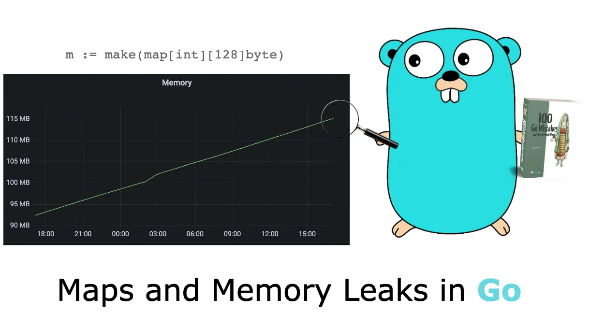
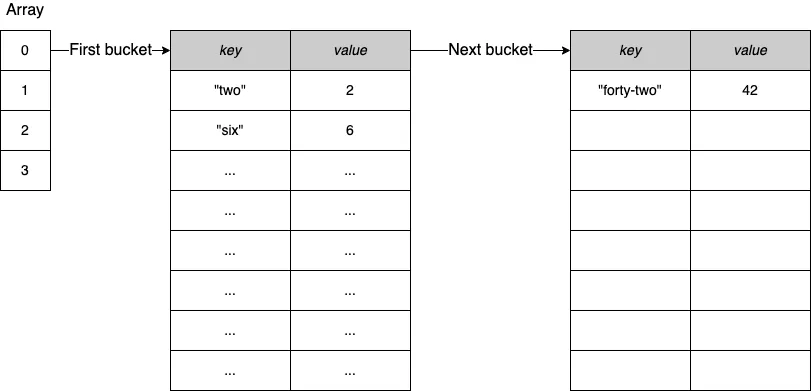

# Maps and memory leaks



When working with maps in Go, we need to understand some important characteristics of how a map grows and shrinks. Let’s delve into this to prevent issues that can cause memory leaks.

First, to view a concrete example of this problem, let’s design a scenario where we will work with the following map:

```go
m := make(map[int][128]byte)
```

Each value of m is an array of 128 bytes. We will do the following:

1. Allocate an empty map.
2. Add 1 million elements.
3. Remove all the elements, and run a Garbage Collection (GC).

After each step, we want to print the size of the heap (using a `printAlloc` utility function). This shows us how this example behaves memory-wise:

```go
func main() {
	n := 1_000_000
	m := make(map[int][128]byte)
	printAlloc()

	for i := 0; i < n; i++ { // Adds 1 million elements
		m[i] = [128]byte{}
	}
	printAlloc()

	for i := 0; i < n; i++ { // Deletes 1 million elements
		delete(m, i)
	}

	runtime.GC() // Triggers a manual GC
	printAlloc()
	runtime.KeepAlive(m) // Keeps a reference to m so that the map isn’t collected
}

func printAlloc() {
	var m runtime.MemStats
	runtime.ReadMemStats(&m)
	fmt.Printf("%d MB\n", m.Alloc/(1024*1024))
}
```

We allocate an empty map, add 1 million elements, remove 1 million elements, and then run a GC. We also make sure to keep a reference to the map using [`runtime.KeepAlive`](https://pkg.go.dev/runtime#KeepAlive) so that the map isn’t collected as well. Let’s run this example:

```
0 MB   <-- After m is allocated
461 MB <-- After we add 1 million elements
293 MB <-- After we remove 1 million elements
```

What can we observe? At first, the heap size is minimal. Then it grows significantly after having added 1 million elements to the map. But if we expected the heap size to decrease after removing all the elements, this isn’t how maps work in Go. In the end, even though the GC has collected all the elements, the heap size is still 293 MB. So the memory shrunk, but not as we might have expected. What’s the rationale? We need to delve into how a map works in Go.

A map provides an unordered collection of key-value pairs in which all the keys are distinct. In Go, a map is based on the hash table data structure: an array where each element is a pointer to a bucket of key-value pairs, as shown in figure 1.

<figure markdown>
  
  <figcaption>Figure 1: A hash table example with a focus on bucket 0.</figcaption>
</figure>

Each bucket is a fixed-size array of eight elements. In the case of an insertion into a bucket that is already full (a bucket overflow), Go creates another bucket of eight elements and links the previous one to it. Figure 2 shows an example:

<figure markdown>
  
  <figcaption>Figure 2: In case of a bucket overflow, Go allocates a new bucket and links the previous bucket to it.</figcaption>
</figure>


Under the hood, a Go map is a pointer to a runtime.hmap struct. This struct contains multiple fields, including a B field, giving the number of buckets in the map:

```go
type hmap struct {
    B uint8 // log_2 of # of buckets
            // (can hold up to loadFactor * 2^B items)
    // ...
}
```

After adding 1 million elements, the value of B equals 18, which means 2¹⁸ = 262,144 buckets. When we remove 1 million elements, what’s the value of B? Still 18. Hence, the map still contains the same number of buckets.

The reason is that the number of buckets in a map cannot shrink. Therefore, removing elements from a map doesn’t impact the number of existing buckets; it just zeroes the slots in the buckets. A map can only grow and have more buckets; it never shrinks.

In the previous example, we went from 461 MB to 293 MB because the elements were collected, but running the GC didn’t impact the map itself. Even the number of extra buckets (the buckets created because of overflows) remains the same.

Let’s take a step back and discuss when the fact that a map cannot shrink can be a problem. Imagine building a cache using a `map[int][128]byte`. This map holds per customer ID (the `int`), a sequence of 128 bytes. Now, suppose we want to save the last 1,000 customers. The map size will remain constant, so we shouldn’t worry about the fact that a map cannot shrink.

However, let’s say we want to store one hour of data. Meanwhile, our company has decided to have a big promotion for Black Friday: in one hour, we may have millions of customers connected to our system. But a few days after Black Friday, our map will contain the same number of buckets as during the peak time. This explains why we can experience high memory consumption that doesn’t significantly decrease in such a scenario.

What are the solutions if we don’t want to manually restart our service to clean the amount of memory consumed by the map? One solution could be to re-create a copy of the current map at a regular pace. For example, every hour, we can build a new map, copy all the elements, and release the previous one. The main drawback of this option is that following the copy and until the next garbage collection, we may consume twice the current memory for a short period.

Another solution would be to change the map type to store an array pointer: `map[int]*[128]byte`. It doesn’t solve the fact that we will have a significant number of buckets; however, each bucket entry will reserve the size of a pointer for the value instead of 128 bytes (8 bytes on 64-bit systems and 4 bytes on 32-bit systems).

Coming back to the original scenario, let’s compare the memory consumption for each map type following each step. The following table shows the comparison.

| Step  | `map[int][128]byte`  | `map[int]*[128]byte`  |
|---|---|---|
|  Allocate an empty map | 0 MB  | 0 MB  |
|  Add 1 million elements | 461 MB  |  182 MB |
| Remove all the elements and run a GC  |  293 MB | 38 MB  |

???+ note

    If a key or a value is over 128 bytes, Go won’t store it directly in the map bucket. Instead, Go stores a pointer to reference the key or the value.

As we have seen, adding n elements to a map and then deleting all the elements means keeping the same number of buckets in memory. So, we must remember that because a Go map can only grow in size, so does its memory consumption. There is no automated strategy to shrink it. If this leads to high memory consumption, we can try different options such as forcing Go to re-create the map or using pointers to check if it can be optimized.
