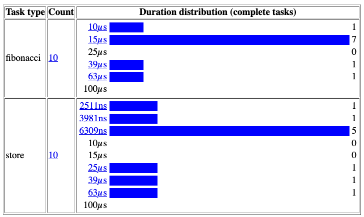

# Not using Go diagnostics tooling


Go offers a few excellent diagnostics tools to help us get insights into how an application performs. This post focuses on the most important ones: profiling and the execution tracer. Both tools are so important that they should be part of the core toolset of any Go developer who is interested in optimization. First, let’s discuss profiling.

## Profiling

Profiling provides insights into the execution of an application. It allows us to resolve performance issues, detect contention, locate memory leaks, and more. These insights can be collected via several profiles:

* `CPU`— Determines where an application spends its time
* `Goroutine`— Reports the stack traces of the ongoing goroutines
* `Heap`— Reports heap memory allocation to monitor current memory usage and check for possible memory leaks
* `Mutex`— Reports lock contentions to see the behaviors of the mutexes used in our code and whether an application spends too much time in locking calls
* `Block`— Shows where goroutines block waiting on synchronization primitives

Profiling is achieved via instrumentation using a tool called a profiler, in Go: `pprof`. First, let’s understand how and when to enable `pprof`; then, we discuss the most critical profile types.

### Enabling pprof

There are several ways to enable `pprof`. For example, we can use the `net/http/pprof` package to serve the profiling data via HTTP:

```go
package main

import (
    "fmt"
    "log"
    "net/http"
    _ "net/http/pprof" // Blank import to pprof
)

func main() {
    // Exposes an HTTP endpoint
    http.HandleFunc("/", func(w http.ResponseWriter, r *http.Request) {
        fmt.Fprintf(w, "")
    })
    log.Fatal(http.ListenAndServe(":80", nil))
}
```

Importing `net/http/pprof` leads to a side effect that allows us to reach the pprof URL: [http://host/debug/pprof](http://host/debug/pprof). Note that enabling `pprof` is safe even in production ([https://go.dev/doc/diagnostics#profiling](https://go.dev/doc/diagnostics#profiling)). The profiles that impact performance, such as CPU profiling, aren’t enabled by default, nor do they run continuously: they are activated only for a specific period.

Now that we have seen how to expose a `pprof` endpoint, let’s discuss the most common profiles.

### CPU Profiling

The CPU profiler relies on the OS and signaling. When it is activated, the application asks the OS to interrupt it every 10 ms by default via a `SIGPROF` signal. When the application receives a `SIGPROF`, it suspends the current activity and transfers the execution to the profiler. The profiler collects data such as the current goroutine activity and aggregates execution statistics that we can retrieve. Then it stops, and the execution resumes until the next `SIGPROF`.

We can access the /debug/pprof/profile endpoint to activate CPU profiling. Accessing this endpoint executes CPU profiling for 30 seconds by default. For 30 seconds, our application is interrupted every 10 ms. Note that we can change these two default values: we can use the `seconds` parameter to pass to the endpoint how long the profiling should last (for example, /debug/pprof/profile?seconds=15), and we can change the interruption rate (even to less than 10 ms). But in most cases, 10 ms should be enough, and in decreasing this value (meaning increasing the rate), we should be careful not to harm performance. After 30 seconds, we download the results of the CPU profiler.

???+ note

    We can also enable the CPU profiler using the `-cpuprofile` flag, such as when running a benchmark. For example, the following command produces the same type of file that can be downloaded via /debug/ pprof/profile.
    
    ```
    $ go test -bench=. -cpuprofile profile.out
    ```

From this file, we can navigate to the results using `go tool`:

```
$ go tool pprof -http=:8080 <file>
```

This command opens a web UI showing the call graph. The next figure shows an example taken from an application. The larger the arrow, the more it was a hot path. We can then navigate into this graph and get execution insights.

<figure markdown>
  
  <figcaption>Figure 1: The call graph of an application during 30 seconds.</figcaption>
</figure>

For example, the graph in the next figure tells us that during 30 seconds, 0.06 seconds were spent in the `decode` method (`*FetchResponse` receiver). Of these 0.06 seconds, 0.02 were spent in `RecordBatch.decode` and 0.01 in `makemap` (creating a map).

<figure markdown>
  
  <figcaption>Figure 2: Example call graph.</figcaption>
</figure>

We can also access this kind of information from the web UI with different representations. For example, the Top view sorts the functions per execution time, and Flame Graph visualizes the execution time hierarchy. The UI can even display the expensive parts of the source code line by line.

???+ note

    We can also delve into profiling data via a command line. However, we focus on the web UI in this post.

Thanks to this data, we can get a general idea of how an application behaves:

* Too many calls to `runtime.mallogc` can mean an excessive number of small heap allocations that we can try to minimize.
* Too much time spent in channel operations or mutex locks can indicate excessive contention that is harming the application’s performance.
* Too much time spent on `syscall.Read` or `syscall.Write` means the application spends a significant amount of time in Kernel mode. Working on I/O buffering may be an avenue for improvement.

These are the kinds of insights we can get from the CPU profiler. It’s valuable to understand the hottest code path and identify bottlenecks. But it won’t determine more than the configured rate because the CPU profiler is executed at a fixed pace (by default, 10 ms). To get finer-grained insights, we should use tracing, which we discuss later in this post.

???+ note

    We can also attach labels to the different functions. For example, imagine a common function called from different clients. To track the time spent for both clients, we can use `pprof.Labels`.

### Heap Profiling

Heap profiling allows us to get statistics about the current heap usage. Like CPU profiling, heap profiling is sample-based. We can change this rate, but we shouldn’t be too granular because the more we decrease the rate, the more effort heap profiling will require to collect data. By default, samples are profiled at one allocation for every 512 KB of heap allocation.

If we reach /debug/pprof/heap/, we get raw data that can be hard to read. However, we can download a heap profile using /debug/pprof/heap/?debug=0 and then open it with `go tool` (the same command as in the previous section) to navigate into the data using the web UI.

The next figure shows an example of a heap graph. Calling the `MetadataResponse.decode` method leads to allocating 1536 KB of heap data (which represents 6.32% of the total heap). However, 0 out of these 1536 KB were allocated by this function directly, so we need to inspect the second call. The `TopicMetadata.decode` method allocated 512 KB out of the 1536 KB; the rest — 1024 KB — were allocated in another method.

<figure markdown>
  
  <figcaption>Figure 3: A heap graph.</figcaption>
</figure>

This is how we can navigate the call chain to understand what part of an application is responsible for most of the heap allocations. We can also look at different sample types:

* `alloc_objects`— Total number of objects allocated
* `alloc_space`— Total amount of memory allocated
* `inuse_object`s — Number of objects allocated and not yet released
* `inuse_space`— Amount of memory allocated and not yet released

Another very helpful capability with heap profiling is tracking memory leaks. With a GC-based language, the usual procedure is the following:

1. Trigger a GC.
2. Download heap data.
3. Wait for a few seconds/minutes.
4. Trigger another GC.
5. Download another heap data.
6. Compare.

Forcing a GC before downloading data is a way to prevent false assumptions. For example, if we see a peak of retained objects without running a GC first, we cannot be sure whether it’s a leak or objects that the next GC will collect.

Using `pprof`, we can download a heap profile and force a GC in the meantime. The procedure in Go is the following:

1. Go to /debug/pprof/heap?gc=1 (trigger the GC and download the heap profile).
2. Wait for a few seconds/minutes.
3. Go to /debug/pprof/heap?gc=1 again.
4. Use go tool to compare both heap profiles:

```
$ go tool pprof -http=:8080 -diff_base <file2> <file1>
```

The next figure shows the kind of data we can access. For example, the amount of heap memory held by the newTopicProducer method (top left) has decreased (–513 KB). In contrast, the amount held by updateMetadata (bottom right) has increased (+512 KB). Slow increases are normal. The second heap profile may have been calculated in the middle of a service call, for example. We can repeat this process or wait longer; the important part is to track steady increases in allocations of a specific object.

<figure markdown>
  
  <figcaption>Figure 4: The differences between the two heap profiles.</figcaption>
</figure>

???+ note

    Another type of profiling related to the heap is `allocs`, which reports allocations. Heap profiling shows the current state of the heap memory. To get insights about past memory allocations since the application started, we can use allocations profiling. As discussed, because stack allocations are cheap, they aren’t part of this profiling, which only focuses on the heap.

### Goroutine Profiling

The `goroutine` profile reports the stack trace of all the current goroutines in an application. We can download a file using /debug/pprof/goroutine/?debug=0 and use go tool again. The next figure shows the kind of information we can get.

<figure markdown>
  
  <figcaption>Figure 5: Goroutine graph.</figcaption>
</figure>

We can see the current state of the application and how many goroutines were created per function. In this case, `withRecover` has created 296 ongoing goroutines (63%), and 29 were related to a call to `responseFeeder`.

This kind of information is also beneficial if we suspect goroutine leaks. We can look at goroutine profiler data to know which part of a system is the suspect.

### Block Profiling

The `block` profile reports where ongoing goroutines block waiting on synchronization primitives. Possibilities include

* Sending or receiving on an unbuffered channel
* Sending to a full channel
* Receiving from an empty channel
* Mutex contention
* Network or filesystem waits

Block profiling also records the amount of time a goroutine has been waiting and is accessible via /debug/pprof/block. This profile can be extremely helpful if we suspect that performance is being harmed by blocking calls.

The `block` profile isn’t enabled by default: we have to call `runtime.SetBlockProfileRate` to enable it. This function controls the fraction of goroutine blocking events that are reported. Once enabled, the profiler will keep collecting data in the background even if we don’t call the /debug/pprof/block endpoint. Let’s be cautious if we want to set a high rate so we don’t harm performance.

???+ note

    If we face a deadlock or suspect that goroutines are in a blocked state, the full goroutine stack dump (/debug/pprof/goroutine/?debug=2) creates a dump of all the current goroutine stack traces. This can be helpful as a first analysis step. For example, the following dump shows a Sarama goroutine blocked for 1,420 minutes on a channel-receive operation:

    ```
    goroutine 2494290 [chan receive, 1420 minutes]:
    github.com/Shopify/sarama.(*syncProducer).SendMessages(0xc00071a090,
    [CA]{0xc0009bb800, 0xfb, 0xfb})
    /app/vendor/github.com/Shopify/sarama/sync_producer.go:117 +0x149
    ```

### Mutex Profiling

The last profile type is related to blocking but only regarding mutexes. If we suspect that our application spends significant time waiting for locking mutexes, thus harming execution, we can use mutex profiling. It’s accessible via /debug/pprof/mutex.

This profile works in a manner similar to that for blocking. It’s disabled by default: we have to enable it using `runtime.SetMutexProfileFraction`, which controls the fraction of mutex contention events reported.

Following are a few additional notes about profiling:

* We haven’t mentioned the `threadcreate` profile because it’s been broken since 2013 ([https://github.com/golang/go/issues/6104](https://github.com/golang/go/issues/6104)).
* Be sure to enable only one profiler at a time: for example, do not enable CPU and heap profiling simultaneously. Doing so can lead to erroneous observations.
* `pprof` is extensible, and we can create our own custom profiles using `pprof.Profile`.

We have seen the most important profiles that we can enable to help us understand how an application performs and possible avenues for optimization. In general, enabling `pprof` is recommended, even in production, because in most cases it offers an excellent balance between its footprint and the amount of insight we can get from it. Some profiles, such as the CPU profile, lead to performance penalties but only during the time they are enabled.

Let’s now look at the execution tracer.

## Execution Tracer

The execution tracer is a tool that captures a wide range of runtime events with `go tool` to make them available for visualization. It is helpful for the following:

* Understanding runtime events such as how the GC performs
* Understanding how goroutines execute
* Identifying poorly parallelized execution

Let’s try it with an example given the Concurrency isn’t Always Faster in Go section. We discussed two parallel versions of the merge sort algorithm. The issue with the first version was poor parallelization, leading to the creation of too many goroutines. Let’s see how the tracer can help us in validating this statement.

We will write a benchmark for the first version and execute it with the -trace flag to enable the execution tracer:

```
$ go test -bench=. -v -trace=trace.out
```

???+ note

    We can also download a remote trace file using the /debug/pprof/ trace?debug=0 pprof endpoint.

This command creates a trace.out file that we can open using go tool:

```
$ go tool trace trace.out
2021/11/26 21:36:03 Parsing trace...
2021/11/26 21:36:31 Splitting trace...
2021/11/26 21:37:00 Opening browser. Trace viewer is listening on
    http://127.0.0.1:54518
```

The web browser opens, and we can click View Trace to see all the traces during a specific timeframe, as shown in the next figure. This figure represents about 150 ms. We can see multiple helpful metrics, such as the goroutine count and the heap size. The heap size grows steadily until a GC is triggered. We can also observe the activity of the Go application per CPU core. The timeframe starts with user-level code; then a “stop the
world” is executed, which occupies the four CPU cores for approximately 40 ms.

<figure markdown>
  
  <figcaption>Figure 6: Showing goroutine activity and runtime events such as a GC phase.</figcaption>
</figure>

Regarding concurrency, we can see that this version uses all the available CPU cores on the machine. However, the next figure zooms in on a portion of 1 ms. Each bar corresponds to a single goroutine execution. Having too many small bars doesn’t look right: it means execution that is poorly parallelized.

<figure markdown>
  
  <figcaption>Figure 7: Too many small bars mean poorly parallelized execution.</figcaption>
</figure>

The next figure zooms even closer to see how these goroutines are orchestrated. Roughly 50% of the CPU time isn’t spent executing application code. The white spaces represent the time the Go runtime takes to spin up and orchestrate new goroutines.

<figure markdown>
  
  <figcaption>Figure 8: About 50% of CPU time is spent handling goroutine switches.</figcaption>
</figure>

Let’s compare this with the second parallel implementation, which was about an order of magnitude faster. The next figure again zooms to a 1 ms timeframe.

<figure markdown>
  
  <figcaption>Figure 9: The number of white spaces has been significantly reduced, proving that the CPU is more fully occupied.</figcaption>
</figure>

Each goroutine takes more time to execute, and the number of white spaces has been significantly reduced. Hence, the CPU is much more occupied executing application code than it was in the first version. Each millisecond of CPU time is spent more efficiently, explaining the benchmark differences.

Note that the granularity of the traces is per goroutine, not per function like CPU profiling. However, it’s possible to define user-level tasks to get insights per function or group of functions using the `runtime/trace` package.

For example, imagine a function that computes a Fibonacci number and then writes it to a global variable using atomic. We can define two different tasks:

```go
var v int64
// Creates a fibonacci task
ctx, fibTask := trace.NewTask(context.Background(), "fibonacci")
trace.WithRegion(ctx, "main", func() {
    v = fibonacci(10)
})
fibTask.End()

// Creates a store task
ctx, fibStore := trace.NewTask(ctx, "store")
trace.WithRegion(ctx, "main", func() {
    atomic.StoreInt64(&result, v)
})
fibStore.End()
```

Using `go tool`, we can get more precise information about how these two tasks perform. In the previous trace UI, we can see the boundaries for each task per goroutine. In User-Defined Tasks, we can follow the duration distribution:

<figure markdown>
  
  <figcaption>Figure 10: Distribution of user-level tasks.</figcaption>
</figure>


We see that in most cases, the `fibonacci` task is executed in less than 15 microseconds, whereas the `store` task takes less than 6309 nanoseconds.

In the previous section, we discussed the kinds of information we can get from CPU profiling. What are the main differences compared to the data we can get from user-level traces?

* CPU profiling:
    * Sample-based
    * Per function
    * Doesn’t go below the sampling rate (10 ms by default)
* User-level traces:
    * Not sample-based
    * Per-goroutine execution (unless we use the `runtime/trace` package)
    * Time executions aren’t bound by any rate
    
In summary, the execution tracer is a powerful tool for understanding how an application performs. As we have seen with the merge sort example, we can identify poorly parallelized execution. However, the tracer’s granularity remains per goroutine unless we manually use `runtime/trace` compared to a CPU profile, for example. We can use both profiling and the execution tracer to get the most out of the standard Go diagnostics tools when optimizing an application.
