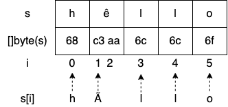

# Go言語でありがちな間違い

このページは『100 Go Mistakes』の内容をまとめたものです。一方で、コミュニティに開かれたページでもあります。「ありがちな間違い」が新たに追加されるべきだとお考えでしたら [community mistake issue](https://github.com/teivah/100-go-mistakes/issues/new?assignees=&labels=community+mistake&template=community_mistake.md&title=) を作成してください。

???+ Tip "Jobs"

    Is your company hiring? [Sponsor](https://github.com/sponsors/teivah/sponsorships?sponsor=teivah&tier_id=386213&preview=true) the Japanese version of this repository and let a significant audience of Go developers (~1k unique visitors per week) know about your opportunities in this section.


???+ warning "注意"

    現在、大幅に多くのコンテンツを追加して強化している新しいバージョンを閲覧しています。このバージョンはまだ開発中です。問題を見つけた場合はどうぞ気軽にPRを作成してください。

## コードとプロジェクト構成

### 意図的でない変数のシャドーイング (#1)

???+ info "要約"

    変数のシャドーイングを避けることは、誤った変数の参照や読み手の混乱を防ぎます。

変数のシャドーイングは、変数名がブロック内で再宣言されることで生じますが、これは間違いを引き起こしやすくします。変数のシャドーイングを禁止するかどうかは個人の好みによります。たとえば、エラーに対して `err` のような既存の変数名を再利用すると便利な場合があります。とはいえ、コードはコンパイルされたものの、値を受け取った変数が予期したものではないというシナリオに直面する可能性があるため、原則として引き続き注意を払う必要があります。

 [ソースコード :simple-github:](https://github.com/teivah/100-go-mistakes/tree/master/src/02-code-project-organization/1-variable-shadowing/main.go)

### 不必要にネストされたコード (#2)

???+ info "要約"

    ネストが深くならないようにし、ハッピーパスを左側に揃えることでメンタルコードモデルを構築することが容易になります。

一般的に、関数がより深いネストを要求するほど、読んで理解することがより複雑になります。私たちのコードの可読性を最適化するために、このルールの適用方法を見ていきましょう。

* `if` ブロックが返されるとき、すべての場合において `else` ブロックを省略する必要があります。 たとえば、次のように書くべきではありません。

```go
if foo() {
    // ...
    return true
} else {
    // ...
}
```

代わりに、次のように `else` ブロックを省略します。

```go
if foo() {
    // ...
    return true
}
// ...
```

* ノンハッピーパスでもこのロジックに従うことが可能です。

```go
if s != "" {
    // ...
} else {
    return errors.New("empty string")
}
```

ここでは、空の `s` がノンハッピーパスを表します。したがって、次のように条件をひっくり返す必要があります。

```go
if s == "" {
    return errors.New("empty string")
}
// ...
```

読みやすいコードを書くことは、すべての開発者にとって重要な課題です。ネストされたブロックの数を減らすよう努め、ハッピーパスを左側に揃え、できるだけ早く戻ることが、コードの可読性を向上させる具体的な手段です。

 [ソースコード :simple-github:](https://github.com/teivah/100-go-mistakes/tree/master/src/02-code-project-organization/2-nested-code/main.go)

### init関数の誤用 (#3)

???+ info "要約"

    変数を初期化するときは、init関数のエラー処理が制限されており、ステートの処理とテストがより複雑になることに注意してください。ほとんどの場合、初期化は特定の関数として処理されるべきです。

init関数は、アプリケーションのステートを初期化するために使用される関数です。引数を取らず、結果も返しません（ `func()` 関数）。パッケージが初期化されると、パッケージ内のすべての定数および変数の宣言が評価されます。次に、init関数が実行されます。

init関数はいくつかの問題を引き起こす可能性があります。

* エラー処理が制限される可能性があります。
* テストの実装方法が複雑になる可能性があります（たとえば、外部依存関係を設定する必要がありますが、単体テストの範囲では必要ない可能性があります）。
* 初期化でステートを設定する必要がある場合は、グローバル変数を使用して行う必要があります。

init関数には注意が必要です。ただし、静的構成の定義など、状況によっては役立つ場合があります。それ以外のほとんどの場合、初期化処理は特定の関数を通じて行われるべきです。

 [ソースコード :simple-github:](https://github.com/teivah/100-go-mistakes/tree/master/src/02-code-project-organization/3-init-functions/)

### ゲッターとセッターの乱用 (#4)

???+ info "要約"

    Go言語では、慣用的にゲッターとセッターの使用を強制することはありません。実利を重視し、効率性と特定の慣習に従うこととの間の適切なバランスを見つけることが、進むべき道であるはずです。

データのカプセル化とは、オブジェクトの値または状態を隠すことを指します。ゲッターとセッターは、エクスポートされていないオブジェクトフィールドの上にエクスポートされたメソッドを提供することでカプセル化を可能にする手段です。

Go言語では、一部の言語で見られるようなゲッターとセッターの自動サポートはありません。また、ゲッターとセッターを使用して構造体フィールドにアクセスすることは必須でも慣用的でもありません。値をもたらさない構造体のゲッターとセッターでコードを埋めるべきではありません。実利を重視し、他のプログラミングパラダイムで時には議論の余地がないと考えられている慣習に従うことと、効率性との間の適切なバランスを見つけるよう努めるべきです。

Go言語は、シンプルさを含む多くの特性を考慮して設計された独自の言語であることを忘れないでください。ただし、ゲッターとセッターの必要性が見つかった場合、または前述のように、前方互換性を保証しながら将来の必要性が予測される場合は、それらを使用することに問題はありません。

### インタフェース汚染 (#5)

???+ info "要約"

    抽象化は作成されるべきものではなく、発見されるべきものです。不必要な複雑さを避けるために、インタフェースは、必要になると予測したときではなく、必要になったときに作成するか、少なくとも抽象化が有効であることを証明できる場合に作成してください。

インタフェースは、オブジェクトの動作を指定する方法を提供します。複数のオブジェクトが実装できる共通項を抽出するために、インタフェースは使用されます。Go言語のインタフェースが大きく異なるのは、暗黙的に満たされることです。オブジェクト `X` がインタフェース `Y` を実装していることを示す `implements` のような明示的なキーワードはありません。

一般に、インタフェースが価値をもたらすと考えられる主要な使用例は３つあります。それは、共通の動作を除外する、何らかの分離を作成する、および型を特定の動作に制限するというものです。ただし、このリストはすべてを網羅しているわけではなく、直面する状況によっても異なります。

多くの場合、インタフェースは抽象化するために作成されます。そして、プログラミングで抽象化するときの主な注意点は、抽象化は作成されるべきではなく、発見されるべきであるということを覚えておくことです。すなわち、そうする直接の理由がない限り、コード内で抽象化すべきではないということです。インタフェースを使って設計するのではなく、具体的なニーズを待つべきです。別の言い方をすれば、インタフェースは必要になると予測したときではなく、必要になったときに作成する必要があります。
インタフェースの過度な使用をした場合の主な問題は何でしょうか。答えは、コードフローがより複雑になることです。役に立たない間接参照を追加しても何の価値もありません。それは価値のない抽象化をすることで、コードを読み、理解し、推論することをさらに困難にします。インタフェースを追加する明確な理由がなく、インタフェースによってコードがどのように改善されるかが不明瞭な場合は、そのインタフェースの目的に異議を唱える必要があります。実装を直接呼び出すのも一つの手です。

コード内で抽象化するときは注意が必要です（抽象化は作成するのではなく、発見する必要があります）。後で必要になる可能性があるものを考慮し、完璧な抽象化レベルを推測して、私たちソフトウェア開発者はコードをオーバーエンジニアリングすることがよくあります。ほとんどの場合、コードが不必要な抽象化で汚染され、読みにくくなるため、このプロセスは避けるべきです。

!!! quote "ロブ・パイク"

    インタフェースでデザインするな。インタフェースを見つけ出せ。

抽象的に問題を解決しようとするのではなく、今解決すべきことを解決しましょう。最後に重要なことですが、インタフェースによってコードがどのように改善されるかが不明瞭な場合は、コードを簡素化するためにインタフェースを削除することを検討する必要があるでしょう。

 [ソースコード :simple-github:](https://github.com/teivah/100-go-mistakes/tree/master/src/02-code-project-organization/5-interface-pollution/)

### 生産者側のインタフェース (#6)

???+ info "要約"

    インタフェースをクライアント側で保持することで不必要な抽象化を回避できます。

Go言語ではインタフェースが暗黙的に満たされます。これは、明示的な実装を持つ言語と比較して大きな変化をもたらす傾向があります。ほとんどの場合、従うべきアプローチは前のセクションで説明したもの――_抽象化は作成するのではなく、発見する必要がある_――に似ています。これは、すべてのクライアントに対して特定の抽象化を強制するのは生産者の役割ではないことを意味します。代わりに、何らかの形式の抽象化が必要かどうかを判断し、そのニーズに最適な抽象化レベルを決定するのはクライアントの責任です。

ほとんどの場合、インタフェースは消費者側に存在する必要があります。ただし、特定の状況（たとえば、抽象化が消費者にとって役立つことがわかっている――予測はしていない――場合）では、それを生産者側で使用したい場合があります。そうした場合、可能な限り最小限に抑え、再利用可能性を高め、より簡単に構成できるように努めるべきです。

 [ソースコード :simple-github:](https://github.com/teivah/100-go-mistakes/tree/master/src/02-code-project-organization/6-interface-producer/)

### インタフェースを返す (#7)

???+ info "要約"

    柔軟性に問題がないようにするために、関数はほとんどの場合、インタフェースではなく具体的​​な実装を返す必要があります。逆に、関数は可能な限りインタフェースを受け入れる必要があります。

ほとんどの場合、インタフェースではなく具体的な実装を返す必要があります。そうでないとパッケージの依存関係により設計がいっそう複雑になり、すべてのクライアントが同じ抽象化に依存する必要があるため、柔軟性に欠ける可能性があります。結論は前のセクションと似ています。抽象化がクライアントにとって役立つことが（予測されるではなく）わかっている場合は、インタフェースを返すことを検討してもよいでしょう。それ以外の場合は、抽象化を強制すべきではありません。それらはクライアントによって発見される必要があります。何らかの理由でクライアントが実装を抽象化する必要がある場合でも、クライアント側でそれを行うことができます。

### `any` は何も言わない (#8)

???+ info "要約"

    `json.Marshal` など考えうるすべての型を受け入れるか返す必要がある場合にのみ `any` を使用してください。それ以外の場合、`any` は意味のある情報を提供せず、呼び出し元が任意のデータ型のメソッドを呼び出すことを許可するため、コンパイル時に問題が発生する可能性があります。

`any` 型は、考えうるすべての型を受け入れるか返す必要がある場合（たとえば、マーシャリングやフォーマットの場合）に役立ちます。原則としてコードを過度に一般化することは何としても避けるべきです。コードの表現力などの他の側面が向上する場合は、コードを少し重複させたほうが良いこともあります。

 [ソースコード :simple-github:](https://github.com/teivah/100-go-mistakes/tree/master/src/02-code-project-organization/8-any/main.go)

### ジェネリックスをいつ使用するべきか理解していない (#9)

???+ info "要約"

    ジェネリックスと型パラメーターを利用することで、要素や動作を除外するためのボイラープレートコードを避けることができます。ただし、型パラメータは時期尚早に使用せず、具体的な必要性がわかった場合にのみ使用してください。そうでなければ、不必要な抽象化と複雑さが生じます。

セクション全文は[こちら](9-generics.md)。

 [ソースコード :simple-github:](https://github.com/teivah/100-go-mistakes/tree/master/src/02-code-project-organization/9-generics/main.go)

### 型の埋め込みで起こりうる問題を把握していない (#10)

???+ info "要約"

    型埋め込みを使用すると、ボイラープレートコードを回避することもできます。ただし、そうすることで、一部のフィールドを非表示にしておく必要がある場合に問題が発生しないようにしてください。

構造体を作成するとき、Go言語は型を埋め込むオプションを提供します。ただし、型埋め込みの意味をすべて理解していないと、予想外の動作が発生する可能性があります。このセクションでは、型を埋め込む方法、それがもたらすもの、および考えられる問題について見ていきます。

Go言語では、名前なしで宣言された構造体フィールドは、埋め込みと呼ばれます。たとえば、次のようなものです。

```go
type Foo struct {
    Bar // 埋め込みフィールド
}

type Bar struct {
    Baz int
}
```

`Foo` 構造体では、`Bar` 型が関連付けられた名前なしで宣言されています。したがって、これは埋め込みフィールドです。

埋め込みを使用することで、埋め込み型のフィールドとメソッドは昇格します。Bar には Baz フィールドが含まれているため、このフィールドは `Foo` に昇格します。したがって、Foo から Baz を利用できるようになります。

型の埋め込みについて何が言えるでしょうか。まず、これが必要になることはほとんどなく、ユースケースが何であれ、おそらく型埋め込みなしでも同様に解決できることを意味します。型の埋め込みは主に利便性を目的として使用されます。ほとんどの場合、それは動作を昇格するために使用されます。

型埋め込みを使用する場合は、次の 2 つの主な制約を念頭に置く必要があります。

* フィールドへのアクセスを簡素化するための糖衣構文としてのみ使用しないでください（ `Foo.Bar.Baz()` の代わりに `Foo.Baz()` など）。 これが唯一の根拠である場合は、内部型を埋め込まず、代わりにフィールドを使いましょう。
* 外部から隠したいデータ（フィールド）や動作（メソッド）を昇格してはなりません。たとえば、構造体に対してプライベートなままにしておく必要があるロック動作にクライアントがアクセスできるようにする場合などです。

これらの制約を念頭に置いて型埋め込みを意識的に使用すると、追加の転送メソッドによるボイラープレートコードを回避するのに役立ちます。ただし、見た目だけを目的としたり、隠すべき要素を昇格したりしないように注意しましょう。

 [ソースコード :simple-github:](https://github.com/teivah/100-go-mistakes/tree/master/src/02-code-project-organization/10-type-embedding/main.go)

### Functional Options パターンを使用していない (#11)

???+ info "要約"

    API に適した方法でオプションを便利に処理するには、Functional Options パターンを使用しましょう。

さまざまな実装方法が存在し、多少の違いはありますが、主な考え方は次のとおりです。

* 未エクスポートの構造体はオプション設定を保持します。
* 各オプションは同じ型、`type Option func(options *options)` エラーを返す関数です。たとえば、`WithPort` はポートを表す `int` 引数を受け取り、`options` 構造体の更新方法を表す `Option` 型を返します。


```go
type options struct {
  port *int
}

type Option func(options *options) error

func WithPort(port int) Option {
  return func(options *options) error {
    if port < 0 {
    return errors.New("port should be positive")
  }
  options.port = &port
  return nil
  }
}

func NewServer(addr string, opts ...Option) ( *http.Server, error) { <1>
  var options options <2>
  for _, opt := range opts { <3>
    err := opt(&options) <4>
    if err != nil {
      return nil, err
    }
  }

// この段階で、options 構造体が構築され、構成が含まれます。
// したがって、ポート設定に関連するロジックを実装できます。
  var port int
  if options.port == nil {
    port = defaultHTTPPort
  } else {
      if *options.port == 0 {
      port = randomPort()
    } else {
      port = *options.port
    }
  }

  // ...
}
```

Functional Options パターンは、オプションを処理するための手軽で API フレンドリーな方法を提供します。 Builder パターンは有効なオプションですが、いくつかの小さな欠点（空の可能性がある構成構造体を渡さなければならない、またはエラーを処理する方法があまり便利ではない）があり、この種の問題において Functional Options パターンがGo言語における慣用的な対処方法になる傾向があります。

 [ソースコード :simple-github:](https://github.com/teivah/100-go-mistakes/tree/master/src/02-code-project-organization/11-functional-options/)

### 誤ったプロジェクト構成 (プロジェクト構造とパッケージ構成) (#12)

全体的な構成に関しては、さまざまな考え方があります。たとえば、アプリケーションをコンテキストごとに整理すべきか、それともレイヤーごとに整理すべきか、それは好みによって異なります。コンテキスト（顧客コンテキスト、契約コンテキストなど）ごとにコードをグループ化することを選ぶ場合もあれば、六角形のアーキテクチャ原則に従うことと、技術層ごとにグループ化することを選ぶ場合もあります。私たちが行う決定が一貫している限り、それがユースケースに適合するなら、それが間違っていることはありません。

パッケージに関しては、従うべきベストプラクティスが複数あります。まず、プロジェクトが過度に複雑になる可能性があるため、時期尚早なパッケージ化は避けるべきです。場合によっては、完璧な構造を最初から無理に作ろうとするよりも、単純な構成を使用し、その内容を理解した上でプロジェクトを発展させるほうが良い場合があります。
粒度も考慮すべき重要な点です。 1 つまたは 2 つのファイルだけを含む数十のナノパッケージを作成することは避けるべきです。その場合、おそらくこれらのパッケージ間の論理的な接続の一部が抜け落ち、読み手にとってプロジェクトが理解しにくくなるからです。逆に、パッケージ名の意味を薄めるような巨大なパッケージも避けるべきです。

パッケージの名前付けも注意して行う必要があります。（開発者なら）誰もが知っているように、名前を付けるのは難しいです。クライアントが Go プロジェクトを理解しやすいように、パッケージに含まれるものではなく、提供するものに基づいてパッケージに名前を付ける必要があります。また、ネーミングには意味のあるものを付ける必要があります。したがって、パッケージ名は短く、簡潔で、表現力豊かで、慣例により単一の小文字にする必要があります。

何をエクスポートするかについてのルールは非常に簡単です。パッケージ間の結合を減らし、エクスポートされる不要な要素を非表示にするために、エクスポートする必要があるものをできる限り最小限に抑える必要があります。要素をエクスポートするかどうか不明な場合は、デフォルトでエクスポートしないようにする必要があります。後でエクスポートする必要があることが判明した場合は、コードを調整できます。また、構造体を encoding/json でアンマーシャリングできるようにフィールドをエクスポートするなど、いくつかの例外にも留意してください。

プロジェクトを構成するのは簡単ではありませんが、これらのルールに従うことで維持が容易になります。ただし、保守性を容易にするためには一貫性も重要であることに注意してください。したがって、コードベース内で可能な限り一貫性を保つようにしましょう。

???+ note "補足"

    Go チームは Go プロジェクトの組織化/構造化に関する公式ガイドラインを 2023 年に発行しました： [go.dev/doc/modules/layout](https://go.dev/doc/modules/layout)

### ユーティリティパッケージの作成 (#13)

???+ info "要約"

    名前付けはアプリケーション設計の重要な部分です。`common` 、`util` 、`shared` のようなパッケージを作成しても、読み手にそれほどの価値をもたらしません。このようなパッケージを意味のある具体的なパッケージ名にリファクタリングしましょう。

また、パッケージに含まれるものではなく、パッケージが提供するものに基づいてパッケージに名前を付けると、その表現力を高める効率的な方法になることにも留意してください。

 [ソースコード :simple-github:](https://github.com/teivah/100-go-mistakes/tree/master/src/02-code-project-organization/13-utility-packages/stringset.go)

### パッケージ名の衝突を無視する (#14)

???+ info "要約"

     混乱、さらにはバグにつながりかねない、変数とパッケージ間の名前の衝突を回避するために、それぞれに一意の名前を使用しましょう。これが不可能な場合は、インポートエイリアスを使用して修飾子を変更してパッケージ名と変数名を区別するか、より良い名前を考えてください。

パッケージの衝突は、変数名が既存のパッケージ名と衝突する場合に発生し、パッケージの再利用が妨げられます。曖昧さを避けるために、変数名の衝突を防ぐ必要があります。衝突が発生した場合は、別の意味のある名前を見つけるか、インポートエイリアスを使用する必要があります。

### コードの文章化が行われていない (#15)

???+ info "要約"

    クライアントとメンテナがコードの意図を理解できるように、エクスポートされた要素を文章化しましょう。

文章化はコーディングの重要な側面です。これにより、クライアントが API をより簡単に使用することができますが、プロジェクトの維持にも役立ちます。Go言語では、コードを慣用的なものにするために、いくつかのルールに従う必要があります。

まず、エクスポートされたすべての要素を文章化する必要があります。構造、インタフェース、関数など、エクスポートする場合は文章化する必要があります。慣例として、エクスポートされた要素の名前から始まるコメントを追加します。

慣例として、各コメントは句読点で終わる完全な文である必要があります。また、関数（またはメソッド）を文章化するときは、関数がどのように実行するかではなく、その関数が何を実行するつもりであるかを強調する必要があることにも留意してください。これはドキュメントではなく、関数とコメントについてです。ドキュメントは理想的には、利用者がエクスポートされた要素の使用方法を理解するためにコードを見る必要がないほど十分な情報を提供する必要があります。

変数または定数を文章化する場合、その目的と内容という 2 つの側面を伝えることが重要かもしれません。前者は、外部クライアントにとって役立つように、コードドキュメントとして存在する必要があります。ただし、後者は必ずしも公開されるべきではありません。

クライアントとメンテナがパッケージの目的を理解できるように、各パッケージをドキュメントする必要もあります。慣例として、コメントは `//Package` で始まり、その後にパッケージ名が続きます。パッケージコメントの最初の行は、パッケージに表示されるため簡潔にする必要があります。そして、次の行に必要な情報をすべて入力します。

コードを文章化することが制約になるべきではありません。クライアントやメンテナがコードの意図を理解するのに役立つ必要があります。

### リンターを使用してない (#16)

???+ info "要約"

    コードの品質と一貫性を向上させるには、リンターとフォーマッターを使用しましょう

リンターは、コードを分析してエラーを検出する自動ツールです。このセクションの目的は、既存のリンターの完全なリストを提供することではありません。そうした場合、すぐに使い物にならなくなってしまうからです。ただし、ほとんどの Go プロジェクトにリンターが不可欠であるということは理解し、覚えておきましょう。

* [https://golang.org/cmd/vet](https://golang.org/cmd/vet)――Go言語の標準コードアナライザー
* [https://github.com/kisielk/errcheck](https://github.com/kisielk/errcheck)――エラーチェッカー
* [https://github.com/fzipp/gocyclo](https://github.com/fzipp/gocyclo)――循環的複雑度アナライザー
* [https://github.com/jgautheron/goconst](https://github.com/jgautheron/goconst)――複数回使用文字列アナライザー


リンターのほかに、コードスタイルを修正するためにコードフォーマッターも使用しましょう。以下に、いくつかのコードフォーマッターを示します。

* [https://golang.org/cmd/gofmt](https://golang.org/cmd/gofmt)――Go言語の標準コードフォーマッター
* [https://godoc.org/golang.org/x/tools/cmd/goimports](https://godoc.org/golang.org/x/tools/cmd/goimports)――Go言語の標準インポートフォーマッター

ほかに golangci-lint ([https://github.com/golangci/golangci-lint](https://github.com/golangci/golangci-lint)) というものがあります。これは、多くの便利なリンターやフォーマッターの上にファサードを提供するリンティングツールです。また、リンターを並列実行して分析速度を向上させることができ、非常に便利です。

リンターとフォーマッターは、コードベースの品質と一貫性を向上させる強力な方法です。時間をかけてどれを使用すべきかを理解し、それらの実行（ CI や Git プリコミットフックなど）を自動化しましょう。

## データ型

### 8 進数リテラルで混乱を招いてしまう (#17)

???+ info "要約"

    既存のコードを読むときは、 `0` で始まる整数リテラルが 8 進数であることに留意してください。また、接頭辞 `0o` を付けることで8進数であることを明確にし、読みやすさを向上させましょう。

8 進数は 0 で始まります（たとえば、`010` は 10 進数の 8 に相当します）。可読性を向上させ、将来のコードリーダーの潜在的な間違いを回避するには、 `0o` 接頭辞を使用して 8 進数であることを明らかにしましょう（例: `0o10` ）。

他の整数リテラル表現にも注意してください。 

 * _バイナリ_ - 接頭辞 `0b` あるいは `0B` を使用します（たとえば、 `0b` は 10 進数の 4 に相当します）
 * _16進数_ - 接頭辞 `0x` あるいは `0X` を使用します（たとえば、 `0xF` は 10 進数の 15 に相当します）。 
 * _虚数_ - 接尾辞 `i` を使用します（たとえば、 `3i` ）

読みやすくするために、区切り文字としてアンダースコア（ _ ）を使用することもできます。たとえば、 10 億は `1_000_000_000` のように書くことができます。アンダースコアは `0b)00_00_01` のように他の表現と併用することもできます。

 [ソースコード :simple-github:](https://github.com/teivah/100-go-mistakes/tree/master/src/03-data-types/17-octal-literals/main.go)

### 整数オーバーフローを無視している (#18)

???+ info "要約"

    Go言語では整数のオーバーフローとアンダーフローが裏側で処理されるため、それらをキャッチする独自の関数を実装できます。

Go言語では、コンパイル時に検出できる整数オーバーフローによってコンパイルエラーが生成されます。たとえば、次のようになります。

```go
var counter int32 = math.MaxInt32 + 1
```

```shell
constant 2147483648 overflows int32
```

ただし、実行時には、整数のオーバーフローまたはアンダーフローは発生しません。これによってアプリケーションのパニックが発生することはありません。この動作はやっかいなバグ（たとえば、負の結果につながる整数の増分や正の整数の加算など）につながる可能性があるため、頭に入れておくことが重要です。

 [ソースコード :simple-github:](https://github.com/teivah/100-go-mistakes/tree/master/src/03-data-types/18-integer-overflows)

### 浮動小数点を理解していない (#19)

???+ info "要約"

    特定のデルタ内で浮動小数点比較を行うと、コードの移植性を確保できます。加算または減算を実行するときは、精度を向上させるために、同程度の大きさの演算をグループ化してください。また、乗算と除算は加算と減算の前に実行してください。

Go言語には、（虚数を除いた場合） `float32` と `float64` という 2 つの浮動小数点型があります。浮動小数点の概念は、小数値を表現できないという整数の大きな問題を解決するために発明されました。予想外の事態を避けるために、浮動小数点演算は実際の演算の近似であることを知っておく必要があります。 

そのために、乗算の例を見てみましょう。

```go
var n float32 = 1.0001
fmt.Println(n * n)
```

このコードにおいては 1.0001 * 1.0001 = 1.00020001 という結果が出力されることを期待すると思います。しかしながら、ほとんどの x86 プロセッサでは、代わりに 1.0002 が出力されます。 

Go言語の `float32` および `float64` 型は近似値であるため、いくつかのルールを念頭に置く必要があります。

* 2 つの浮動小数点数を比較する場合は、その差が許容範囲内であることを確認する。
* 加算または減算を実行する場合、精度を高めるために、同じ桁数の演算をグループ化する。
* 精度を高めるため、一連の演算で加算、減算、乗算、除算が必要な場合は、乗算と除算を最初に実行する。

 [ソースコード :simple-github:](https://github.com/teivah/100-go-mistakes/tree/master/src/03-data-types/19-floating-points/main.go)

### スライスの長さと容量を理解していない (#20)

???+ info "要約"

    Go 開発者ならば、スライスの長さと容量の違いを理解するべきです。スライスの長さはスライス内の使用可能な要素の数であり、スライスの容量はバッキング配列内の要素の数です。

セクション全文は[こちら](20-slice.md)。

 [ソースコード :simple-github:](https://github.com/teivah/100-go-mistakes/tree/master/src/03-data-types/20-slice-length-cap/main.go)

### 非効率なスライスの初期化 (#21)

???+ info "要約"

    スライスを作成するとき、長さがすでにわかっている場合は、指定された長さまたは容量でスライスを初期化しましょう。これにより、割り当ての数が減り、パフォーマンスが向上します。

`make` を使用してスライスを初期化するときに、長さとオプションの容量を指定できます。これらのパラメータの両方に適切な値を渡すことが適当であるにもかかわらず、それを忘れるのはよくある間違いです。実際、複数のコピーが必要になり、一時的なバッキング配列をクリーンアップするために GC に追加の労力がかかる可能性があります。パフォーマンスの観点から言えば、Go ランタイムに手を差し伸べない理由はありません。 

オプションは、指定された容量または指定された長さのスライスを割り当てることです。 これら 2 つの解決策のうち、2 番目の解決策の方がわずかに高速である傾向があることがわかりました。ただし、特定の容量と追加を使用すると、場合によっては実装と読み取りが容易になることがあります。

 [ソースコード :simple-github:](https://github.com/teivah/100-go-mistakes/tree/master/src/03-data-types/21-slice-init/main.go)

### nil と空のスライスを混同している (#22)

???+ info "要約"

    `encoding/json` や `reflect` パッケージなどを使用するときによくある混乱を避けるためには、nil スライスと空のスライスの違いを理解する必要があります。どちらも長さゼロ、容量ゼロのスライスですが、割り当てを必要としないのは nil スライスだけです。

Go言語では、nil と空のスライスは区別されます。nil スライスは `nil` に等しいのに対し、空のスライスの長さはゼロです。nil スライスは空ですが、空のスライスは必ずしも`nil` であるとは限りません。一方、nil スライスには割り当ては必要ありません。このセクション全体を通して、以下の方法を使用することによって、状況に応じてスライスを初期化することを見てきました。

 * 最終的な長さが不明でスライスが空の場合は `var s []string` 
 * nil と空のスライスを作成する糖衣構文としての `[]string(nil)` 
 * 将来の長さがわかっている場合は `make([]string, length)` 

要素なしでスライスを初期化する場合、最後のオプション `[]string{}` は避けるべきです。最後に、予想外の動作を防ぐために、使用するライブラリが nil と空のスライスを区別しているかどうかを確認してみましょう。

 [ソースコード :simple-github:](https://github.com/teivah/100-go-mistakes/tree/master/src/03-data-types/22-nil-empty-slice/)

### スライスが空かどうかを適切に確認しない (#23)

???+ info "要約"

    スライスに要素が含まれていないことを確認するには、その長さを確認しましょう。これは、スライスが `nil` であるか空であるかに関係なく機能します。マップについても同様です。明確な API を設計するには、nil スライスと空のスライスを区別しないでください。

スライスに要素があるかどうかを判断するには、スライスが nil かどうか、またはその長さが 0 に等しいかどうかを確認することで判断できます。スライスが空である場合とスライスが nil である場合の両方をカバーできるため、長さを確かめることが最良の方法です。

一方、インタフェースを設計するときは、軽微なプログラミングエラーを起こさないよう nil スライスと空のスライスを区別しないようにする必要があります。スライスを返すときに、nil または空のスライスを返すかどうかは、意味的にも技術的にも違いはありません。コーラーにとってはどちらも同じことを意味するはずです。この原理はマップでも同じです。マップが空かどうかを確認するには、それが nil かどうかではなく、その長さを確認しましょう。

 [ソースコード :simple-github:](https://github.com/teivah/100-go-mistakes/tree/master/src/03-data-types/23-checking-slice-empty/main.go)

### スライスのコピーを正しく作成していない (#24)

???+ info "要約"

    組み込み関数 `copy` を使用してあるスライスを別のスライスにコピーするには、コピーされる要素の数が 2 つのスライスの長さの間の最小値に相当することに注意してください。

要素をあるスライスから別のスライスにコピーする操作は、かなり頻繁に行われます。コピーを使用する場合、コピー先にコピーされる要素の数は 2 つのスライスの長さの間の最小値に相当することに注意する必要があります。また、スライスをコピーするための他の代替手段が存在することにも留意してください。そのため、コードベースでそれらを見つけても驚くことはありません。

 [ソースコード :simple-github:](https://github.com/teivah/100-go-mistakes/tree/master/src/03-data-types/24-slice-copy/main.go)

### `append` の使用による予想外の副作用 (#25)

???+ info "要約"

    2つの異なる関数が同じ配列に基づくスライスを使用する場合に、copy または完全スライス式を使用することで `append` による衝突を防ぐことができます。ただし、大きなスライスを縮小する場合、メモリリークを防ぐことができるのはスライスのコピーだけです。

スライスを使用するときは、予想外の副作用につながる状況に直面する可能性があることを覚えておく必要があります。結果のスライスの長さがその容量より小さい場合、追加によって元のスライスが変更される可能性があります。起こり得る副作用の範囲を制限したい場合は、スライスのコピーまたは完全スライス式を使用できます。これにより、コピーを実行できなくなります。

???+ note "補足"

    `s[low:high:max]`（完全スライス式）――この命令文は、容量が `max - low` に等しいことを除けば、`s[low:high]` で作成されたスライスと同様のスライスを作成します。

 [ソースコード :simple-github:](https://github.com/teivah/100-go-mistakes/tree/master/src/03-data-types/25-slice-append/main.go)

### スライスとメモリリーク (#26)

???+ info "要約"

    ポインタのスライスまたはポインタフィールドを持つ構造体を操作する場合、スライス操作によって除外された要素を nil とすることでメモリリークを回避できます。

#### 容量漏れ

大きなスライスまたは配列をスライスすると、メモリ消費が高くなる可能性があることに注意してください。残りのスペースは GC によって再利用されず、少数の要素しか使用しないにもかかわらず、大きなバッキング配列が保持されます。スライスのコピーをすることで、このような事態を防ぐことができます。

 [ソースコード :simple-github:](https://github.com/teivah/100-go-mistakes/tree/master/src/03-data-types/26-slice-memory-leak/capacity-leak)

#### スライスとポインタ

ポインタまたはポインタフィールドを含む構造体を使用してスライス操作をする場合、GC がこれらの要素を再利用しないことを知っておく必要があります。その場合の選択肢は、コピーを実行するか、残りの要素またはそのフィールドを明示的に `nil` とすることです。

 [ソースコード :simple-github:](https://github.com/teivah/100-go-mistakes/tree/master/src/03-data-types/26-slice-memory-leak/slice-pointers)

### 非効率なマップの初期化 (#27)

???+ info "要約"

    マップを作成するとき、その長さがすでにわかっている場合は、指定された長さで初期化します。これにより、割り当ての数が減り、パフォーマンスが向上します。

マップは、キー・値ペアの順序なしコレクションを提供します。なお、それぞれのペアは固有のキーを持ちます。Go言語では、マップはハッシュテーブルデータ構造に基づいています。内部的には、ハッシュテーブルはバケットの配列であり、各バケットはキー・値ペアの配列へのポインタです。 

マップに含まれる要素の数が事前にわかっている場合は、その初期サイズを指定して作成する必要があります。マップの増大は、十分なスペースを再割り当てし、すべての要素のバランスを再調整する必要があるため、計算量が非常に多くなりますが、これによりそれを回避することができます。

 [ソースコード :simple-github:](https://github.com/teivah/100-go-mistakes/tree/master/src/03-data-types/27-map-init/main_test.go)

### マップとメモリリーク (#28)

???+ info "要約"

    マップはメモリ内で常に増大する可能性がありますが、縮小することはありません。したがって、メモリの問題が発生する場合は、マップを強制的に再生成したり、ポインタを使用したりするなど、さまざまな手段を試すことができます。

セクション全文は[こちら](28-maps-memory-leaks.md)。

 [ソースコード :simple-github:](https://github.com/teivah/100-go-mistakes/tree/master/src/03-data-types/28-map-memory-leak/main.go)

### 誤った方法による値の比較 (#29)

???+ info "要約"

    Go言語で型を比較す​​るには、2 つの型が比較可能ならば、== 演算子と != 演算子を使用できます。真偽値、数値、文字列、ポインタ、チャネル、および構造体が完全に比較可能な型で構成されています。それ以外は、 `reflect.DeepEqual` を使用してリフレクションの代償を支払うか、独自の実装とライブラリを使用することができます。

効果的に比較するには、 `==` と `!=` の使用方法を理解することが不可欠です。これらの演算子は、比較可能な被演算子で使用できます。 

* _真偽値_ - 2 つの真偽値が等しいかどうかを比較します。 
* _数値 (int、float、および complex 型)_ - 2 つの数値が等しいかどうかを比較します。 
* _文字列_ - 2 つの文字列が等しいかどうかを比較します。 
* _チャネル_ - 2 つのチャネルが同じ make 呼び出しによって作成されたか、または両方が nil であるかを比較します。 
* _インタフェース_ - 2 つのインタフェースが同じ動的タイプと等しい動的値を持つかどうか、または両方が nil であるかどうかを比較します。 
* _ポインタ_ - 2 つのポインタがメモリ内の同じ値を指しているか、または両方とも nil であるかを比較します。 
* _構造体と配列_ - 類似した型で構成されているかどうかを比較します。

???+ note "補足"

    `?` 、 `>=` 、 `<` 、および `>` 演算子を数値型で使用して値を比較したり、文字列で字句順序を比較したりすることもできます。

被演算子が比較できない場合（スライスとマップなど）、リフレクションなどの他の方法を利用する必要があります。リフレクションはメタプログラミングの一種であり、アプリケーションがその構造と動作を内省して変更する機能を指します。たとえば、Go言語では `reflect.DeepEqual` を使用できます。この関数は、2つの値を再帰的に調べることによって、2つの要素が完全に等しいかどうかを報告します。受け入れられる要素は、基本型に加えて、配列、構造体、スライス、マップ、ポインタ、インタフェース、関数です。しかし、最大の落とし穴はパフォーマンス上のペナルティです。 

実行時のパフォーマンスが重要な場合は、独自のメソッドを実装することが最善となる可能性があります。

追記：標準ライブラリには既に比較メソッドがいくつかあることを覚えておく必要があります。たとえば、最適化された `bytes.Compare` 関数を使用して、2つのバイトスライスを比較できます。独自のメソッドを実装する前に、車輪の再発明をしないようにしましょう。

 [ソースコード :simple-github:](https://github.com/teivah/100-go-mistakes/tree/master/src/03-data-types/29-comparing-values/main.go)

## 制御構造

### 要素が `range` ループ内でコピーされることを知らない  (#30)

???+ info "要約"

    `range` ループ内の value 要素はコピーです。したがって、たとえば構造体を変更するには、そのインデックスを介してアクセスするか、従来の `for` ループを介してアクセスしましょう（変更する要素またはフィールドがポインタである場合を除く）。

range ループを使用すると、さまざまなデータ構造に反復処理を行うことができます。 

 * 文字列
 * 配列
 * 配列へのポインタ
 * スライス
 * マップ
 * 受信チャネル 

古典的な `for` ループと比較すると、`range` ループはその簡潔な構文のおかげで、これらのデータ構造のすべての要素に反復処理をするのに便利です。

ただし、range ループ内の値要素はコピーであることを覚えておく必要があります。したがって、値を変更する必要がある構造体の場合、変更する値またはフィールドがポインタでない限り、要素自体ではなくコピーのみを更新します。range ループまたは従来の for ループを使用してインデックス経由で要素にアクセスすることが推奨されます。

 [ソースコード :simple-github:](https://github.com/teivah/100-go-mistakes/tree/master/src/04-control-structures/30-range-loop-element-copied/)

### `range` ループ（チャネルと配列）での引数の評価方法を知らない (#31)

???+ info "要約"

    `range` 演算子に渡される式はループの開始前に 1 回だけ評価されることを理解すると、チャネルまたはスライスの反復処理における非効率な割り当てなどのありがちな間違いを回避できます。

range ループは、（タイプに関係なく）コピーを実行することにより、ループの開始前に、指定された式を 1 回だけ評価します。たとえば、誤った要素にアクセスしてしまう、というようなありがちな間違いを避けるために、この動作を覚えておく必要があります。たとえば

```go
a := [3]int{0, 1, 2}
for i, v := range a {
    a[2] = 10
    if i == 2 {
        fmt.Println(v)
    }
}
```

このコードは、最後のインデックスを 10 に更新します。しかし、このコードを実行すると、10 は出力されません。 2 が出力されます。

 [ソースコード :simple-github:](https://github.com/teivah/100-go-mistakes/tree/master/src/04-control-structures/31-range-loop-arg-evaluation/)

###  `range` ループ内におけるポインタ要素の使用が及ぼす影響を分かっていない (#32)

???+ info "要約"

    ローカル変数を使用するか、インデックスを使用して要素にアクセスすると、ループ内でポインタをコピーする際の間違いを防ぐことができます。

`range` ループを使用してデータ構造に反復処理を施す場合、すべての値が単一の一意のアドレスを持つ一意の変数に割り当てられることを思い出してください。ゆえに、各反復処理中にこの変数を参照するポインタを保存すると、同じ要素、つまり最新の要素を参照する同じポインタを保存することになります。この問題は、ループのスコープ内にローカル変数を強制的に作成するか、インデックスを介してスライス要素を参照するポインタを作成することで解決できます。どちらの解決策でも問題ありません。

 [ソースコード :simple-github:](https://github.com/teivah/100-go-mistakes/tree/master/src/04-control-structures/32-range-loop-pointers/)


### マップの反復処理中に誤った仮定をする（反復処理中の順序付けとマップの挿入） (#33)

???+ info "要約"

    マップを使用するときに予測可能な出力を保証するには、マップのデータ構造が次のとおりであることに注意してください。 

 * データをキーで並べ替えません 
 * 挿入順序は保持されません 
 * 反復処理順序は決まっていません
 * ある反復処理中に追加された要素がその処理中に生成されることを保証しません

<!-- TODO -->

 [ソースコード :simple-github:](https://github.com/teivah/100-go-mistakes/tree/master/src/04-control-structures/33-map-iteration/main.go)

### `break` 文がどのように機能するかを分かっていない (#34)

???+ info "要約"

    ラベルと `break` または `continue` の併用は、特定の命令文を強制的に中断します。これは、ループ内の `switch` または `select` 文で役立ちます。 

通常、break 文はループの実行を終了するために使用されます。ループが switch または select と組み合わせて使用​​される場合、目的の命令文ではないのに中断させてしまう、というミスをすることが開発者にはよくあります。たとえば

```go
for i := 0; i < 5; i++ {
    fmt.Printf("%d ", i)

    switch i {
    default:
    case 2:
        break
    }
}
```

break 文は `for` ループを終了させるのではなく、代わりに `switch` 文を終了させます。したがって、このコードは 0 から 2 までを反復する代わりに、0 から 4 までを反復します（`0 1 2 3 4`）。

覚えておくべき重要なルールの1つは、 `break` 文は最も内側の `for` 、`switch` 、または `select` 文の実行を終了するということです。前の例では、`switch` 文を終了します。 

`switch` 文の代わりにループを中断する最も慣用的な方法はラベルを使用することです。

```go hl_lines="1 8"
loop:
    for i := 0; i < 5; i++ {
        fmt.Printf("%d ", i)

        switch i {
        default:
        case 2:
            break loop
        }
    }
```

ここでは、`loop` ラベルを `for` ループに関連付けます。 次に、`break` 文に `loop` ラベルを指定するので、switch ではなく loop が中断されます。よって、この新しいバージョンは予想どおり `0 1 2` を出力します。

 [ソースコード :simple-github:](https://github.com/teivah/100-go-mistakes/tree/master/src/04-control-structures/34-break/main.go)

### ループ内で `defer` を使用する (#35)

???+ info "要約"

    関数内のループロジックの抽出は、各反復の最後での `defer` 文の実行につながります。

`defer` 文は、上位ブロックの関数が戻るまで呼び出しの実行を遅らせます。これは主に定型コードを削減するために使用されます。たとえば、リソースを最終的に閉じる必要がある場合は、`defer` を使用して、`return` を実行する前にクロージャ呼び出しを繰り返すことを避けることができます。 

`defer` でよくあるミスの1つは、_上位ブロック_ の関数が戻ったときに関数呼び出しがスケジュールされることを忘れることです。たとえば

```go
func readFiles(ch <-chan string) error {
    for path := range ch {
        file, err := os.Open(path)
        if err != nil {
            return err
        }

        defer file.Close()

        // ファイルの処理をする
    }
    return nil
}
```

`defer` 呼び出しは、各ループ反復中ではなく、`readFiles` 関数が返されたときに実行されます。 `readFiles` が返らない場合、ファイル記述子は永久に開いたままになり、リークが発生します。 

この問題を解決するための一般的な手段の1つは、 `defer` の後に、各反復中に呼び出される上位ブロックの関数を作成することです。

```go
func readFiles(ch <-chan string) error {
    for path := range ch {
        if err := readFile(path); err != nil {
            return err
        }
    }
    return nil
}

func readFile(path string) error {
    file, err := os.Open(path)
    if err != nil {
        return err
    }

    defer file.Close()

    // ファイルの処理をする
    return nil
}
```

別の解決策は、`readFile` 関数をクロージャにすることですが、本質的には同じです。別の上位ブロックの関数を追加して、各反復中に `defer` 呼び出しを実行します。

 [ソースコード :simple-github:](https://github.com/teivah/100-go-mistakes/tree/master/src/04-control-structures/35-defer-loop/main.go)

## 文字列

### ルーンを理解していない (#36)

???+ info "要約"

    ルーンが Unicode コードポイントの概念に対応し、複数のバイトで構成される可能性があることを理解することは、 Go 開発者が文字列を正確に操作するために不可欠です。

Go言語ではルーンがあらゆる場所に使用されるため、次の点を理解することが重要です。 

* 文字セットは文字の集合ですが、エンコーディングは文字セットをバイナリに変換する方法を記述します。
* Go言語では、文字列は任意のバイトの不変スライスを参照します。
* Go言語のソースコードは UTF-8 でエンコードされています。したがって、すべの文字列リテラルは UTF-8 文字列です。ただし、文字列には任意のバイトが含まれる可能性があるため、文字列が（ソースコードではない）他の場所から取得された場合、その文字列が UTF-8 エンコーディングに基づいている保証はありません。
* `rune` は Unicode コードポイントの概念に対応し、単一の値で表されるアイテムを意味します。
* UTF-8 を使用すると、Unicode コードポイントを 1 ～ 4 バイトにエンコードできます。
* Go言語で文字列に対して `len()` を使用すると、ルーン数ではなくバイト数が返されます。

 [ソースコード :simple-github:](https://github.com/teivah/100-go-mistakes/tree/master/src/05-strings/36-rune/main.go)

### 文字列に対する不正な反復処理 (#37)

???+ info "要約"

    `range` 演算子を使用して文字列を反復処理すると、ルーンのバイトシーケンスの開始インデックスに対応するインデックスを使用してルーンが反復処理されます。特定のルーンインデックス（ 3 番目のルーンなど）にアクセスするには、文字列を `[]rune` に変換します。 

文字列の反復処理は、開発者にとって一般的な操作です。おそらく、文字列内の各ルーンに対して操作を実行するか、特定の部分文字列を検索する独自の関数を実装する必要があるでしょう。どちらの場合も、文字列の異なるルーンを反復処理する必要があります。しかし、反復処理がどのように機能するかについては困惑しやすいです。 

次の例を考えてみましょう。

```go
s := "hêllo"
for i := range s {
    fmt.Printf("position %d: %c\n", i, s[i])
}
fmt.Printf("len=%d\n", len(s))
```

```
position 0: h
position 1: Ã
position 3: l
position 4: l
position 5: o
len=6
```

混乱を招く可能性のある 3 点を取り上げましょう。 

* 2 番目のルーンは、出力では ê ではなく Ã になります。 
* position 1 から position 3 にジャンプしました。 position 2 には何があるのでしょうか。
* len は 6 を返しますが、s には 5 つのルーンしか含まれていません。 

結果の最後から見ていきましょう。len はルーン数ではなく、文字列内のバイト数を返すことはすでに述べました。文字列リテラルを `s` に割り当てているため、`s` は UTF-8 文字列です。一方、特殊文字「ê」は 1 バイトでエンコードされません。 2 バイト必要です。したがって、`len(s)` を呼び出すと 6 が返されます。 

前の例では、各ルーンを反復処理していないことを理解する必要があります。代わりに、ルーンの各開始インデックスを反復処理します。 

 

`s[i]` を出力しても i 番目のルーンは出力されません。インデックス `i` のバイトの UTF-8 表現を出力します。したがって、 `hêllo` の代わりに `hÃllo` を出力がされます。 

さまざまなルーン文字をすべて出力したい場合は、 `range` 演算子の value 要素を使用することができます。

```go
s := "hêllo"
for i, r := range s {
    fmt.Printf("position %d: %c\n", i, r)
}
```

または、文字列をルーンのスライスに変換し、それを反復処理することもできます。

```go hl_lines="2"
s := "hêllo"
runes := []rune(s)
for i, r := range runes {
    fmt.Printf("position %d: %c\n", i, r)
}
```

この解決策では、以前の解決策と比較して実行時のオーバーヘッドが発生することに注意してください。実際、文字列をルーンのスライスに変換するには、追加のスライスを割り当て、バイトをルーンに変換する必要があります。文字列のバイト数を n とすると、時間計算量は O(n) になります。したがって、すべてのルーンを反復処理する場合は、最初の解決策を使用するべきです。 

ただし、最初の方法を使用して文字列の i 番目のルーンにアクセスしたい場合は、ルーンインデックスにアクセスできません。代わりに、バイトシーケンス内のルーンの開始インデックスがわかります。

```go
s := "hêllo"
r := []rune(s)[4]
fmt.Printf("%c\n", r) // o
```

 [ソースコード :simple-github:](https://github.com/teivah/100-go-mistakes/tree/master/src/05-strings/37-string-iteration/main.go)

### trim 関数の誤用 (#38)

???+ info "要約"

    `strings.TrimRight` ・ `strings.TrimLeft` は、指定されたセットに含まれるすべての末尾・先頭のルーンを削除しますが、 `strings.TrimSuffix` ・ `strings.TrimPrefix` は、指定された接尾辞・接頭辞のない文字列を返します。

たとえば

```go
fmt.Println(strings.TrimRight("123oxo", "xo"))
```

は 123 を出力します


逆に、 `strings.TrimLeft` は、セットに含まれる先頭のルーンをすべて削除します。 

一方、`strings.TrimSuffix` ・ `strings.TrimPrefix` は、指定された末尾の接尾辞・接頭辞を除いた文字列を返します。

 [ソースコード :simple-github:](https://github.com/teivah/100-go-mistakes/tree/master/src/05-strings/38-trim/main.go)

### 最適化が不十分な文字列の連結 (#39)

???+ info "要約"

    文字列のリストの連結は、反復ごとに新しい文字列が割り当てられないように、`strings.Builder` を使用して行う必要があります。

`+=` 演算子を用いてスライスのすべての文字列要素を連結する `concat` 関数を考えてみましょう。

```go
func concat(values []string) string {
    s := ""
    for _, value := range values {
        s += value
    }
    return s
}
```

各反復中に、 `+=` 演算子は `s` と value 文字列を連結します。一見すると、この関数は間違っていないように見えるかもしれません。しかし、この実装は、文字列の核となる特性の1つである不変性を忘れています。したがって、各反復では `s` は更新されません。メモリ内に新しい文字列を再割り当てするため、この関数のパフォーマンスに大きな影響を与えます。 

幸いなことに、 `strings.Builder` を用いることで、この問題に対処する解決策があります。

```go hl_lines="2 4"
func concat(values []string) string {
    sb := strings.Builder{}
    for _, value := range values {
        _, _ = sb.WriteString(value)
    }
    return sb.String()
}
```

各反復中に、value の内容を内部バッファに追加する `WriteString` メソッドを呼び出して結果の文字列を構築し、メモリのコピーを最小限に抑えることができました。

???+ note "補足"

    `WriteString` は 2 番目の出力としてエラーを返しますが、意図的に無視しましょう。実際、このメソッドは nil エラー以外を返すことはありません。では、このメソッドがシグネチャの一部としてエラーを返す目的は何でしょうか。`strings.Builder` は `io.StringWriter` インタフェースを実装しており、これには `WriteString(s string) (n int, err error)` という1つのメソッドが含まれています。したがって、このインタフェースに準拠するには、`WriteString` はエラーを返さなければならないのです。

内部的には、`strings.Builder` はバイトスライスを保持します。 `WriteString` を呼び出すたびに、このスライスに追加する呼び出しが行われます。これには2つの影響があります。まず、 `append` の呼び出しが衝突状態を引き起こす可能性があるため、この構造体は同時に使用されるべきではありません。2番目の影響は、 [非効率なスライスの初期化 (#21)](#21) で見たものです。スライスの将来の長さがすでにわかっている場合は、それを事前に割り当てる必要があります。そのために、`strings.Builder` は別の `n` バイトのためのスペースを保証するメソッド `Grow(n int)` を持っています。

```go
func concat(values []string) string {
    total := 0
    for i := 0; i < len(values); i++ {
        total += len(values[i])
    }

    sb := strings.Builder{}
    sb.Grow(total) (2)
    for _, value := range values {
        _, _ = sb.WriteString(value)
    }
    return sb.String()
}
```

ベンチマークを実行して 3 つのバージョン（ `+=` を使用した V1 、事前割り当てなしで `strings.Builder{}` を使用した V2 、事前割り当てありの `strings.Builder{}` を使用した V3 ）を比較してみましょう。入力スライスには 1,000 個の文字列が含まれており、各文字列には 1,000 バイトが含まれています。

```
BenchmarkConcatV1-4             16      72291485 ns/op
BenchmarkConcatV2-4           1188        878962 ns/op
BenchmarkConcatV3-4           5922        190340 ns/op
```

ご覧のとおり、最新バージョンが最も効率的で、V1 より 99% 、V2 より 78% 高速です。 

`strings.Builder` は、文字列のリストを連結するための解決策として推奨されます。通常、これはループ内で使用する必要があります。いくつかの文字列 （名前と姓など）を連結するだけの場合、 `strings.Builder` の使用は、 `+=` 演算子や `fmt.Sprintf` と比べて可読性が低くなるからです。

 [ソースコード :simple-github:](https://github.com/teivah/100-go-mistakes/tree/master/src/05-strings/39-string-concat/)

### 無駄な文字列変換 (#40)

???+ info "要約"

    `bytes` パッケージは `strings` パッケージと同じ操作を提供してくれることを覚えておくと、余分なバイト・文字列変換を避けることができます。

文字列または `[]byte` を扱うことを選択する場合、ほとんどのプログラマーは利便性のために文字列を好む傾向があります。しかし、ほとんどの I/O は実際には `[]byte` で行われます。たとえば、`io.Reader`、`io.Writer`、および `io.ReadAll` は文字列ではなく `[]byte` を処理します。 

文字列と `[]byte` のどちらを扱うべきか迷ったとき、`[]byte` を扱う方が必ずしも面倒だというわけではないことを思い出してください。strings パッケージからエクスポートされたすべての関数には、`bytes` パッケージに代替機能があります。 `Split`、`Count`、`Contains`、`Index` などです。したがって、I/O を実行しているかどうかに関係なく、文字列の代わりにバイトを使用してワークフロー全体を実装でき、追加の変換コストを回避できるかどうかを最初に確認しましょう。

 [ソースコード :simple-github:](https://github.com/teivah/100-go-mistakes/tree/master/src/05-strings/40-string-conversion/main.go)

### 部分文字列とメモリリーク (#41)

???+ info "要約"

    部分文字列の代わりにコピーを使用すると、部分文字列操作によって返される文字列が同じバイト配列によってサポートされるため、メモリリークを防ぐことができます。

[スライスとメモリリーク (#26)](#26) では、スライスまたは配列のスライスがメモリリークの状況を引き起こす可能性があることを確認しました。この原則は、文字列および部分文字列の操作にも当てはまります。 

Go言語で部分文字列操作を使用するときは、2 つのことに留意する必要があります。まず、提供される間隔はルーン数ではなく、バイト数に基づいています。次に、結果の部分文字列が最初の文字列と同じバッキング配列を共有するため、部分文字列操作によりメモリリークが発生する可能性があります。これを防ぐ方法は、文字列のコピーを手動で実行するか、Go 1.18 から実装されている `strings.Clone` を使用することです。

 [ソースコード :simple-github:](https://github.com/teivah/100-go-mistakes/tree/master/src/05-strings/41-substring-memory-leak/main.go)

## 関数とメソッド

### どの型のレシーバーを使用すればよいかわかっていない (#42)

???+ info "要約"

    値レシーバーとポインタレシーバーのどちらを使用するかは、どの型なのか、変化させる必要があるかどうか、コピーできないフィールドが含まれているかどうか、オブジェクトはどれくらい大きいのか、などの要素に基づいて決定する必要があります。分からない場合は、ポインタレシーバを使用してください。

値レシーバーとポインタレシーバーのどちらを選択するかは、必ずしも簡単ではありません。選択に役立ついくつかの条件について説明しましょう。 

_ポインタレシーバーでなければならない_ とき

* メソッドがレシーバーを変化させる必要がある場合。このルールは、受信側がスライスであり、メソッドが要素を追加する必要がある場合にも有効です。

  ```go
  type slice []int

  func (s *slice) add(element int) {
      *s = append(*s, element)
  }
  ```

* メソッドレシーバーにコピーできないフィールドが含まれている場合。sync パッケージの型部分はその一例になります（ [sync 型のコピー (#74)](#sync-74) を参照）。

_ポインタレシーバーであるべき_ とき

* レシーバーが大きなオブジェクトの場合。ポインタを使用すると、大規模なコピーの作成が防止されるため、呼び出しがより効率的になります。どれくらいの大きさなのか確証がない場合は、ベンチマークが解決策になる可能性があります。多くの要因に依存するため、特定のサイズを指定することはほとんど不可能です。 

_値レシーバーでなければならない_ とき

* レシーバーの不変性を強制する必要がある場合。 
* レシーバーがマップ、関数、チャネルの場合。それ以外の場合はコンパイルエラーが発生します。 

_値レシーバーであるべき_ とき

* レシーバーが変化させる必要のないスライスの場合。 
* レシーバーが、`time.Time` などの小さな配列または構造体で、可変フィールドを持たない値型である場合。 
* レシーバーが `int`、`float64`、または `string` などの基本型の場合。 

もちろん、特殊なケースは常に存在するため、すべてを網羅することは不可能ですが、このセクションの目標は、ほとんどのケースをカバーするためのガイダンスを提供することです。通常は、そうしない正当な理由がない限り、値レシーバーを使用して間違いありません。分からない場合は、ポインタレシーバを使用する必要があります。

 [ソースコード :simple-github:](https://github.com/teivah/100-go-mistakes/tree/master/src/06-functions-methods/42-receiver/)

### 名前付き結果パラメータをまったく使用していない (#43)

???+ info "要約"

    名前付き結果パラメーターの使用は、特に複数の結果パラメーターが同じ型を持つ場合、関数・メソッドの読みやすさを向上させる効率的な方法です。場合によっては、名前付き結果パラメータはゼロ値に初期化されるため、この方法が便利ですらあることもあります。ただし潜在的な副作用には注意してください。

関数またはメソッドでパラメータを返すとき、これらのパラメータに名前を付けて、通常の変数として使用できます。結果パラメーターに名前を付けると、関数・メソッドの開始時にそのパラメーターはゼロ値に初期化されます。名前付き結果パラメータを使用すると、 むき出しの return 文（引数なし） を呼び出すこともできます。その場合、結果パラメータの現在の値が戻り値として使用されます。 

以下は、名前付き結果パラメータ `b` を用いた例です。

```go
func f(a int) (b int) {
    b = a
    return
}
```

この例では、結果パラメータに名前 `b` を付けています。引数なしで return を呼び出すと、`b` の現在の値が返されます。 

場合によっては、名前付きの結果パラメーターによって可読性が向上することもあります。たとえば、2 つのパラメーターが同じ型である場合などです。その他にも、利便性のために用いることができます。ゆえに、明確な利点がある場合は、慎重になりながらも名前付き結果パラメータを使用するべきです。

 [ソースコード :simple-github:](https://github.com/teivah/100-go-mistakes/tree/master/src/06-functions-methods/43-named-result-parameters/main.go)

### 名前付き結果パラメータによる予想外の副作用 (#44)

???+ info "要約"

    [#43](#43) を参照してください。

名前付き結果パラメータが状況によっては役立つ理由について説明しました。 ただし、これらはゼロ値に初期化されるため、十分に注意しないと、軽微なバグが発生する可能性があります。たとえば、このコードはどこが間違っているでしょうか。

```go
func (l loc) getCoordinates(ctx context.Context, address string) (
    lat, lng float32, err error) {
    isValid := l.validateAddress(address) (1)
    if !isValid {
        return 0, 0, errors.New("invalid address")
    }

    if ctx.Err() != nil { (2)
        return 0, 0, err
    }

    // 座標を取得して返す
}
```

一瞥しただけではエラーは明らかではないかもしれません。`if ctx.Err() != nil` スコープで返されるエラーは `err` です。しかし、`err` 変数には値を割り当てていません。`error` 型のゼロ値、 `nil` に割り当てられたままです。したがって、このコードは常に nil エラーを返します。 

名前付き結果パラメータを使用する場合、各パラメータはゼロ値に初期化されることに注意してください。このセクションで説明したように、これにより、見つけるのが必ずしも簡単ではない軽微なバグが発生する可能性があります。ゆえに、潜在的な副作用を避けるために、名前付き結果パラメーターを使用するときは注意してください。

 [ソースコード :simple-github:](https://github.com/teivah/100-go-mistakes/tree/master/src/06-functions-methods/44-side-effects-named-result-parameters/main.go)

### nil レシーバーを返す (#45)

???+ info "要約"

    インタフェースを返すときは、nil ポインタを返すのではなく、明示的な nil 値を返すように注意してください。そうしなければ、意図しない結果が発生し、呼び出し元が nil ではない値を受け取る可能性があります。

<!-- TODO -->

 [ソースコード :simple-github:](https://github.com/teivah/100-go-mistakes/tree/master/src/06-functions-methods/45-nil-receiver/main.go)

### 関数入力にファイル名を使用している (#46)

???+ info "要約"

    ファイル名の代わりに `io.Reader` 型を受け取るように関数を設計すると、関数の再利用性が向上し、テストが容易になります。

ファイル名をファイルから読み取るための関数入力として受け入れることは、ほとんどの場合、「コードの臭い」とみなされるべきです（ `os.Open` などの特定の関数を除く）。複数のファイルを作成することにになるかもしれず、単体テストがより複雑になる可能性があるからです。また、関数の再利用性も低下します （ただし、すべての関数が再利用されるわけではありません）。 `io.Reader` インタフェースを使用すると、データソースが抽象化されます。入力がファイル、文字列、HTTP リクエスト、gRPC リクエストのいずれであるかに関係なく、実装は再利用でき、簡単にテストできます。

 [ソースコード :simple-github:](https://github.com/teivah/100-go-mistakes/tree/master/src/06-functions-methods/46-function-input/)

### `defer` 引数とレシーバーがどのように評価されるかを知らない（引数の評価、ポインター、および値レシーバー） (#47)

???+ info "要約"

    ポインタを `defer` 関数に渡すことと、呼び出しをクロージャ内にラップすることが、引数とレシーバーの即時評価を克服するために実現可能な解決策です。 

`defer` 関数では、引数は、上位ブロックの関数が戻ってからではなく、すぐに評価されます。たとえば、このコードでは、常に同じステータス――空の文字列――で `notify` と `incrementCounter` を呼び出します。

```go
const (
    StatusSuccess  = "success"
    StatusErrorFoo = "error_foo"
    StatusErrorBar = "error_bar"
)

func f() error {
    var status string
    defer notify(status)
    defer incrementCounter(status)

    if err := foo(); err != nil {
        status = StatusErrorFoo
        return err
    }

    if err := bar(); err != nil {
        status = StatusErrorBar
        return err
    }

    status = StatusSuccess <5>
    return nil
}
```

たしかに、`notify(status)` と `incrementCounter(status)` を `defer` 関数として呼び出しています。したがって、Go言語は、defer を使用した段階で `f` がステータスの現在の値を返すと、これらの呼び出しの実行を遅らせ、空の文字列を渡します。 

`defer` を使い続けたい場合の主な方法は 2 つあります。 

最初の解決策は文字列ポインタを渡すことです。

```go hl_lines="3 4"
func f() error {
    var status string
    defer notify(&status) 
    defer incrementCounter(&status)

    // 関数のそれ以外の部分は変更なし
}
```

`defer` を使用すると、引数（ここではステータスのアドレス）がすぐに評価されます。ステータス自体は関数全体で変更されますが、そのアドレスは割り当てに関係なく一定のままです。よって、`notify` または `incrementCounter` が文字列ポインタによって参照される値を使用する場合、期待どおりに動作します。ただし、この解決策では 2 つの関数のシグネチャを変更する必要があり、それが常に可能であるとは限りません。 

別の解決策があります――クロージャ（本体の外部から変数を参照する匿名関数値）を `defer` 文として呼び出すことです。

```go hl_lines="3 4 5 6"
func f() error {
    var status string
    defer func() {
        notify(status)
        incrementCounter(status)
    }()

    // 関数のそれ以外の部分は変更なし
}
```

ここでは、`notify` と `incrementCounter` の両方の呼び出しをクロージャ内にラップします。このクロージャは、本体の外部からステータス変数を参照します。ゆえに、`status` は、`defer` を呼び出したときではなく、クロージャが実行されたときに評価されます。この解決策は正しく機能する上に、シグネチャを変更するために `notify` や `incrementCounter` を必要としません。 

この動作はメソッドレシーバーにも適用されることにも注意してください。レシーバーはすぐに評価されます。

 [ソースコード :simple-github:](https://github.com/teivah/100-go-mistakes/tree/master/src/06-functions-methods/47-defer-evaluation/)

## エラー処理

### パニック (#48)

???+ info "要約"

    `panic` の使用は、Go言語でエラーに対処するための手段です。ただし、これは回復不能な状況でのみ使用するようにしてください。たとえば、ヒューマンエラーを通知する場合や、必須の依存関係の読み込みに失敗した場合などです。

Go言語では、panic は通常の流れを停止する組み込み関数です。

```go
func main() {
    fmt.Println("a")
    panic("foo")
    fmt.Println("b")
}
```

このコードは a を出力し、b を出力する前に停止します。

```
a
panic: foo

goroutine 1 [running]:
main.main()
        main.go:7 +0xb3
```

panic の使用は慎重にすべきです。代表的なケースが 2 つあり、1 つはヒューマンエラーを通知する場合（例: [`sql.Register`](https://cs.opensource.google/go/go/+/refs/tags/go1.20.7:src/database/sql/sql.go;l=44)ドライバーが `nil` または既に登録されている場合に panic を起こします）、もう 1 つはアプリケーションが必須の依存関係の生成に失敗した場合です。結果として、例外的にアプリケーションを停止します。それ以外のほとんどの場合においては、エラー処理は、最後の戻り引数として適切なエラー型を返す関数を通じて行うべきです。

 [ソースコード :simple-github:](https://github.com/teivah/100-go-mistakes/tree/master/src/07-error-management/48-panic/main.go)

### エラーをラップすべきときを知らない (#49)

???+ info "要約"

    エラーをラップすると、エラーをマークしたり、追加のコンテキストを提供したりできます。ただし、エラーラッピングにより、呼び出し元がソースエラーを利用できるようになるため、潜在的な結合が発生します。それを避けたい場合は、エラーラッピングを使用しないでください。

Go 1.13 以降、%w ディレクティブを使用すれば簡単にエラーをラップできるようになりました。エラーラッピングとは、ソースエラーも使用できるようにするラッパーコンテナ内でエラーをラップまたはパックすることです。一般に、エラーラッピングの主な使用例は次の 2 つです。 

* エラーにさらにコンテキストを加える
* エラーを特定のエラーとしてマークする 

エラーを処理するとき、エラーをラップするかどうかを決定できます。ラッピングとは、エラーにさらにコンテキストを追加したり、エラーを特定のタイプとしてマークしたりすることです。エラーをマークする必要がある場合は、独自のエラー型を作成する必要があります。ですが、新たにコンテキストを加えたいだけの場合は、新しいエラー型を作成する必要がないため、%w ディレクティブを指定して fmt.Errorf を使用しましょう。ただし、エラーラッピングにより、呼び出し元がソースエラーを利用できるようになるため、潜在的な結合が生じます。それを避けたい場合は、エラーのラッピングではなく、エラーの変換を使用する必要があります。たとえば、%v ディレクティブを指定した fmt.Errorf を使用します。

 [ソースコード :simple-github:](https://github.com/teivah/100-go-mistakes/tree/master/src/07-error-management/49-error-wrapping/main.go)

### エラー型の不正な比較 (#50)

???+ info "要約"

    Go 1.13 のエラーラッピングを `%w` ディレクティブと `fmt.Errorf` で使用する場合、型に対するエラーの比較は `errors.As` を通じて行う必要があります。そうでなければ、返されたエラーがラップされている場合、評価に失敗します。

<!-- TODO -->

 [ソースコード :simple-github:](https://github.com/teivah/100-go-mistakes/tree/master/src/07-error-management/50-compare-error-type/main.go)

### エラー値の不正な比較 (#51)

???+ info "要約"

    Go 1.13 のエラーラッピングを `%w` ディレクティブと `fmt.Errorf` で使用する場合、エラーと値の比較は `errors.As` を通じて行う必要があります。そうでなければ、返されたエラーがラップされている場合、評価に失敗します。 

センチネルエラーはグローバル変数として定義されたエラーのことです。

```go
import "errors"

var ErrFoo = errors.New("foo")
```
一般に、慣例として `Err` で始め、その後にエラー型を続けます。ここでは `ErrFoo` です。センチネルエラーは、_予期される_ エラー、つまりクライアントが確認することを期待するエラーを伝えます。一般的なガイドラインとして

* 予期されるエラーはエラー値（センチネルエラー）として設計する必要があります： `var ErrFoo =errors.New("foo")`。 
* 予期しないエラーはエラー型として設計する必要があります： `BarError` は `error` インタフェースを実装した上で `type BarError struct { ... }`。 

アプリケーションで `%w` ディレクティブと `fmt.Errorf` を使用してエラーラップを使用する場合、特定の値に対するエラーのチェックは `==` の代わりに `errors.Is` を使用して行いましょう。それによって、センチネルエラーがラップされている場合でも、`errors.Is` はそれを再帰的にアンラップし、チェーン内の各エラーを提供された値と比較できます。

 [ソースコード :simple-github:](https://github.com/teivah/100-go-mistakes/tree/master/src/07-error-management/51-comparing-error-value/main.go)

### エラーの 2 回処理 (#52)

???+ info "要約"

    ほとんどの場合、エラーは 1 回で処理されるべきです。エラーをログに記録することは、エラーを処理することです。すなわち、ログに記録するかエラーを返すかを選択する必要があります。多くの場合、エラーラッピングは、エラーに追加のコンテキストを提供し、ソースエラーを返すことができるため、解決策になります。 

エラーを複数回処理することは、特にGo言語に限らず、開発者が頻繁にやってしまうミスです。これにより、同じエラーが複数回ログに記録され、デバッグが困難になる状況が発生する可能性があります。 

エラー処理は 1 度で済ますべきだということを覚えておきましょう。エラーをログに記録することは、エラーを処理することです。つまり、行うべきは、ログに記録するか、エラーを返すかのどちらかだということです。これにより、コードが簡素化され、エラーの状況についてより適切な洞察が得られます。エラーラッピングは、ソースエラーを伝え、エラーにコンテキストを追加できるため、最も使い勝手の良い手段になります。

 [ソースコード :simple-github:](https://github.com/teivah/100-go-mistakes/tree/master/src/07-error-management/52-handling-error-twice/main.go)

### エラー処理をしない (#53)

???+ info "要約"

    関数呼び出し中であっても、`defer` 関数内であっても、エラーを無視するときは、ブランク識別子を使用して明確に行うべきです。そうしないと、将来の読み手がそれが意図的だったのか、それともミスだったのか困惑する可能性があります。

 [ソースコード :simple-github:](https://github.com/teivah/100-go-mistakes/tree/master/src/07-error-management/53-not-handling-error/main.go)

### `defer` エラーを処理しない (#54)

???+ info "要約"

    多くの場合、`defer` 関数によって返されるエラーを無視すべきではありません。状況に応じて、直接処理するか、呼び出し元に伝えましょう。これを無視する場合は、ブランク識別子を使用してください。 

次のコードを考えてみましょう。

```go
func f() {
  // ...
  notify() // エラー処理は省略されています
}

func notify() error {
  // ...
}
```

保守性の観点から、このコードはいくつかの問題を引き起こす可能性があります。ある人がこれを読むことを考えてみます。読み手は、notify がエラーを返すにもかかわらず、そのエラーが親関数によって処理されないことに気づきます。エラー処理が意図的であるかどうかを果たして推測できるでしょうか。以前の開発者がそれを処理するのを忘れたのか、それとも意図的に処理したのかを知ることができるでしょうか。

これらの理由により、エラーを無視したい場合、ブランク識別子（ `_` ）を使うほかありません。

```go
_ = notify
```

コンパイルと実行時間の点では、この方法は最初のコード部分と比べて何も変わりません。しかし、この新しいバージョンでは、私たちがエラーに関心がないことを明らかにしています。また、エラーが無視される理由を示すコメントを追加することもできます。

```go
// 最大でも 1 回の伝達 
// それゆえ、エラーが発生した場合にそれらの一部が失われることは許容されます
_ = notify()
```

 [ソースコード :simple-github:](https://github.com/teivah/100-go-mistakes/tree/master/src/07-error-management/54-defer-errors/main.go)

## 並行処理：基礎

### 並行処理と並列処理の混同 (#55)

???+ info "要約"

    並行処理と並列処理の基本的な違いを理解することは、 Go 開発者にとって必須です。並行処理は構造に関するものですが、並列処理は実行に関するものです。 

並行処理と並列処理は同じではありません。 

* 並行処理は構造に関するものです。別々の並行ゴルーチンが取り組むことができるさまざまな段階を導入することで、逐次処理を並行処理に変更できます。 
* 並列処理は実行に関するものです。並列ゴルーチンをさらに追加することで、段階レベルで並列処理を使用できます。 

まとめると、並行処理は、並列化できる部分をもつ問題を解決するための構造を提供します。すなわち、_並行処理により並列処理が可能_ になります 。

<!-- TODO Include Rob Pike's talk link-->

### 並行処理のほうが常に早いと考えている (#56)

???+ info "要約"

    熟練した開発者になるには、並行処理が必ずしも高速であるとは限らないことを認識する必要があります。最小限のワークロードの並列処理を伴う解決策は、必ずしも逐次処理より高速であるとは限りません。逐次処理と並行処理のベンチマークは、仮定を検証する方法であるべきです。

セクション全文は[こちら](56-concurrency-faster.md)。

 [ソースコード :simple-github:](https://github.com/teivah/100-go-mistakes/tree/master/src/08-concurrency-foundations/56-faster/)

### チャネルまたはミューテックスをいつ使用するべきかについて戸惑っている (#57)

???+ info "要約"

    ゴルーチンの相互作用を認識していることは、チャネルとミューテックスのどちらを選択するかを決定するときにも役立ちます。一般に、並列ゴルーチンには同期が必要であり、したがってミューテックスが必要です。反対に、並行ゴルーチンは通常、調整とオーケストレーション、つまりチャネルを必要とします。 

並行処理の問題を考慮すると、チャネルまたはミューテックスを使用した解決策を実装できるかどうかが必ずしも明確ではない可能性があります。Go言語は通信によるメモリの共有を促進するため、起こりうる間違いのうちの一つは、ユースケースにかかわらず、チャネルの使用を常に強制することです。しかしながら、2 つの方法は補完的なものであると見なすべきです。  

チャネルまたはミューテックスはどのような場合に使用する必要があるのでしょうか。次の図の例をバックボーンとして使用します。この例には、特定の関係を持つ 3 つの異なるゴルーチンがあります。 

* G1 と G2 は並列ゴルーチンです。チャネルからメッセージを受信し続ける同じ関数を実行する 2 つのゴルーチン、あるいは同じ HTTP ハンドラを同時に実行する 2 つのゴルーチンかもしれません。 
* G1 と G3 は並行ゴルーチンであり、G2 と G3 も同様です。すべてのゴルーチンは全体の並行構造の一部ですが、G1 と G2 が最初のステップを実行し、G3 が次のステップを実行します。 

<!-- TODO Include figure-->

原則として、並列ゴルーチンは、スライスなどの共有リソースにアクセスしたり変更したりする必要がある場合などに、_同期_する必要があります。同期はミューテックスでは強制されますが、どのチャネル型でも強制されません（バッファありチャネルを除く）。したがって、一般に、並列ゴルーチン間の同期はミューテックスを介して達成される必要があります。 

一方、一般に、並行ゴルーチンは _調整およびオーケストレーション_ をする必要があります。たとえば、G3 が G1 と G2 の両方からの結果を集約する必要がある場合、G1 と G2 は新しい中間結果が利用可能であることを G3 に通知する必要があります。この調整はコミュニケーションの範囲、つまりチャネルに該当します。 

並行ゴルーチンに関しては、リソースの所有権をあるステップ（G1 および G2）から別のステップ（G3）に移管したい場合もあります。たとえば、G1 と G2 によって共有リソースが豊かになっている場合、ある時点でこのジョブは完了したと見なされます。ここでは、チャネルを使用して、特定のリソースの準備ができていることを通知し、所有権の移転を処理する必要があります。 

ミューテックスとチャネルには異なるセマンティクスがあります。ステートを共有したいとき、または共有リソースにアクセスしたいときは、ミューテックスによってこのリソースへの排他的アクセスが保証されます。反対に、チャネルはデータの有無（`chan struct{}` の有無）に関係なくシグナルを行う仕組みです。調整や所有権の移転はチャネルを通じて行う必要があります。ゴルーチンが並列か並行かを知ることが重要です。一般に、並列ゴルーチンにはミューテックスが必要で、並行ゴルーチンにはチャネルが必要です。

### 競合問題を理解していない（データ競合と競合状態、そしてGo言語のメモリモデル） (#58)

???+ info "要約"

    並行処理に熟達するということは、データ競合と競合状態が異なる概念であることを理解することも意味します。データ競合は、複数のゴルーチンが同じメモリ位置に同時にアクセスし、そのうちの少なくとも 1 つが書き込みを行っている場合に発生します。一方、データ競合がないことが必ずしも決定的実行を意味するわけではありません。動作が制御できないイベントの順序やタイミングに依存している場合、これは競合状態です。

競合問題は、プログラマーが直面する可能性のあるバグの中で最も困難かつ最も潜伏性の高いバグの 1 つとなります。Go 開発者として、私たちはデータ競合と競合状態、それらが及ぼしうる影響、およびそれらを回避する方法などの重要な側面を理解する必要があります。

#### データ競合

データ競合は、2 つ以上のゴルーチンが同じメモリ位置に同時にアクセスし、少なくとも 1 つが書き込みを行っている場合に発生します。この場合、危険な結果が生じる可能性があります。さらに悪いことに、状況によっては、メモリ位置に無意味なビットの組み合わせを含む値が保持されてしまう可能性があります。 

さまざまな手法を駆使して、データ競合の発生を防ぐことができます。たとえば 

* `sync/atomic` パッケージを使用する 
* 2 つのゴルーチンを同期する際にミューテックスのような特定の目的のためのデータ構造を利用する
* チャネルを使用して 2 つのゴルーチンが通信し、変数が一度に 1 つのゴルーチンだけによって更新されるようにする

#### 競合状態

実行したい操作に応じて、データ競合のないアプリケーションが必ずしも決定的な結果を意味するでしょうか。そうとはいえません。

競合状態は、動作が制御できないイベントのシーケンスまたはタイミングに依存する場合に発生します。ここでは、イベントのタイミングがゴルーチンの実行順序です。 

まとめると、並行処理のアプリケーションで作業する場合、データ競合は競合状態とは異なることを理解することが不可欠です。データ競合は、複数のゴルーチンが同じメモリ位置に同時にアクセスし、そのうちの少なくとも 1 つが書き込みを行っている場合に発生します。データ競合とは、予想外の動作を意味します。ただし、データ競合のないアプリケーションが必ずしも決定的な結果を意味するわけではありません。データ競合がなくても、アプリケーションは制御されていないイベント（ゴルーチンの実行、チャネルへのメッセージの発信速度、データベースへの呼び出しの継続時間など）に依存する挙動を持つことがあります。その場合は競合状態です。並行処理のアプリケーションの設計に熟練するには、両方の概念を理解することが肝要です。

 [ソースコード :simple-github:](https://github.com/teivah/100-go-mistakes/tree/master/src/08-concurrency-foundations/58-races/)

### ワークロードタイプごとの並行処理の影響を理解していない (#59)

???+ info "要約"

    一定数のゴルーチンを作成するときは、ワークロードのタイプを考慮してください。CPU バウンドのゴルーチンを作成するということは、この数を `GOMAXPROCS` 変数（デフォルトではホスト上の CPU コアの数に基づく）に近づけることを意味します。I/O バウンドのゴルーチンの作成は、外部システムなどの他の要因に依存します。 

 プログラミングでは、ワークロードの実行時間は次のいずれかによって制限されます。 

 * CPU の速度 - たとえば、マージソートアルゴリズムの実行がこれにあたります。このワークロードは CPU バウンドと呼ばれます。 
 * I/O の速度 - たとえば、REST 呼び出しやデータベースクエリの実行がこれにあたります。このワークロードは I/O バウンドと呼ばれます。 
 * 利用可能なメモリの量 - このワークロードはメモリバウンドと呼ばれます。

???+ note "補足"

    ここ数十年でメモリが非常に安価になったことを考慮すると、 3 つ目は現在では最もまれです。したがって、このセクションでは、最初の 2 つのワークロードタイプ、CPU バウンドと I/O バウンドに焦点を当てます。 

 ワーカーによって実行されるワークロードが I/O バウンドである場合、値は主に外部システムに依存します。逆に、ワークロードが CPU に依存している場合、ゴルーチンの最適な数は利用可能な CPU コアの数に近くなります（ベストプラクティスは `runtime.GOMAXPROCS` を使用することです）。並行処理のアプリケーションを設計する場合、ワークロードのタイプ（ I/O あるいは CPU ）を知ることが重要です。

 [ソースコード :simple-github:](https://github.com/teivah/100-go-mistakes/tree/master/src/08-concurrency-foundations/59-workload-type/main.go)

### Go Context に対する誤解 (#60)

???+ info "要約"

    Go Context は、Go言語の並行処理の基礎の一部でもあります。 Context を使用すると、デッドライン、キーと値のリストを保持できます。

!!! quote "https://pkg.go.dev/context"

    Context は、デッドライン、キャンセルシグナル、その他の値を API の境界を越えて伝達します。
 
#### デッドライン

デッドラインとは、次のいずれかで決定される特定の時点を指します。 

* 現在からの `time.Duration` （例：250 ms）
* `time.Time` （例：2023-02-07 00:00:00 UTC） 

デッドラインのセマンティクスは、これを過ぎた場合は進行中のアクティビティを停止する必要があることを伝えます。アクティビティとは、たとえば、チャネルからのメッセージの受信を待機している I/O リクエストやゴルーチンです。 

#### キャンセルシグナル 

Go Context のもう 1 つの使用例は、キャンセルシグナルを伝送することです。別のゴルーチン内で `CreateFileWatcher(ctx context.Context, filename string)` を呼び出すアプリケーションを作成することを想像してみましょう。この関数は、ファイルから読み取りを続けて更新をキャッチする特定のファイルウォッチャーを作成します。提供された Context が期限切れになるかキャンセルされると、この関数はそれを処理してファイル記述子を閉じます。 

#### Context Value

Go Context の最後の使用例は、キーと値のリストを運ぶことです。 Context にキーと値のリストを含める意味は何でしょうか。Go Context は汎用的であるため、使用例は無限にあります。 

たとえば、トレースを使用する場合、異なるサブ関数の間で同じ相関 ID を共有したいことがあるかもしれません。一部の開発者は、この ID を関数シグネチャの一部にするにはあまりに侵略的だと考えるかもしれません。この点に関して、与えられた Context の一部としてそれを含めることを決定することもできます。 

#### Context のキャンセルをキャッチする 

`context.Context` タイプは、受信専用の通知チャネル `<-chan struct{}` を返す `Done` メソッドをエクスポートします。このチャネルは、 Context に関連付けられた作業をキャンセルする必要がある場合に閉じられます。たとえば 

* `context.WithCancel`で作成された Context に関連する Done チャネルは、cancel関数が呼び出されると閉じられます。 
* `context.WithDeadline`で作成した Context に関連する Done チャネルは、デッドラインを過ぎると閉じられます。 

注意すべき点の 1 つは、内部チャネルは、特定の値を受け取ったときではなく、 Context がキャンセルされたとき、またはデッドラインに達したときに閉じる必要があるということです。チャネルのクローズは、すべての消費者ゴルーチンが受け取る唯一のチャネルアクションであるためです。このようにして、 Context がキャンセルされるか、デッドラインに達すると、すべての消費者に通知が届きます。 

まとめると、熟練した Go 開発者になるには、 Context とその使用方法について理解する必要があります。原則として、ユーザーが待機させられる関数は Context を取得するべきです。これにより、上流の呼び出し元がこの関数をいつ呼び出すかを決定できるようになるからです。

 [ソースコード :simple-github:](https://github.com/teivah/100-go-mistakes/tree/master/src/08-concurrency-foundations/60-contexts/main.go)

## 並行処理：実践

### 不適切な Context を広めてしまう (#61)

???+ info "要約"

    Context を伝播する際には、Context をキャンセルできる条件を理解することが重要です。たとえば、レスポンスが送信された際に HTTP ハンドラが Context をキャンセルするときなどです。 

多くの状況では、Go Context を伝播することが推奨されます。ただし、Context の伝播によって軽微なバグが発生し、サブ関数が正しく実行されなくなる場合があります。 

次の例を考えてみましょう。いくつかのタスクを実行してレスポンスを返す HTTP ハンドラを公開します。ただし、レスポンスを返す直前に、それを Kafka トピックに送信したいと思っています。HTTP コンシューマにレイテンシの点でペナルティを課したくないので、publish アクションを新しいゴルーチン内で非同期に処理したいと考えています。たとえば、Context がキャンセルされた場合にメッセージの publish アクションを中断できるように、Context を受け入れる `publish` 関数を自由に使えるとします。可能な実装は次のとおりです。

```go
func handler(w http.ResponseWriter, r *http.Request) {
    response, err := doSomeTask(r.Context(), r)
    if err != nil {
        http.Error(w, err.Error(), http.StatusInternalServerError)
    return
    }
    go func() {
        err := publish(r.Context(), response)
        // err の処理をする
    }()
    writeResponse(response)
}
```

このコードの何が問題なのでしょうか。HTTP リクエストに付された Context は、さまざまな状況でキャンセルされる可能性があることを知っておく必要があります。 

* クライアントの接続が終了したとき 
* HTTP/2リクエストの場合、リクエストがキャンセルされたとき
* クライアントにレスポンスが書き戻されたとき 

最初の 2 つのケースでは、処理はおそらく正しく行われます。たとえば、doSomeTask からレスポンスを受け取ったものの、クライアントが接続を閉じた場合、メッセージが publish されないように、Context が既にキャンセルされた状態で publish を呼び出しても問題はおそらく起きません。しかし、最後のケースはどうでしょうか。

レスポンスがクライアントに書き込まれると、要求に関連付けられた Context がキャンセルされます。したがって、競合状態に直面します。 

* レスポンスが Kafka の publish 後に書かれた場合、レスポンスを返し、メッセージを正常に公開します。 
* ただし、Kafka の publish 前または publish 中にレスポンスが書かれた場合、メッセージは publish されるべきではありません。 

後者の場合、HTTP レスポンスをすぐに返すので、publish を呼び出すとエラーが返されます。

???+ note "補足"

    Go 1.21 からは、キャンセルせずに新しい Context を作成する方法が追加されました。 [`context.WithoutCancel`](https://pkg.go.dev/context#WithoutCancel) は、親がキャンセルされたときにキャンセルされていない親のコピーを返します。 

まとめると、Context の伝播は慎重に行う必要があります。

 [ソースコード :simple-github:](https://github.com/teivah/100-go-mistakes/tree/master/src/09-concurrency-practice/61-inappropriate-context/main.go)

### 停止すべきときを知らずにゴルーチンを開始してしまう (#62)

???+ info "要約"

    リークを避けることは、ゴルーチンが開始されるたびに、最終的に停止する必要があることを意味します。

ゴルーチンは簡単に行うことができます。非常に簡単であるため、新しいゴルーチンをいつ停止するかについての計画を必ずしも立てていない可能性があり、リークにつながることがあります。ゴルーチンをいつ停止すればよいかわからないのは、Go言語でよくある設計上の問題であり、並行処理におけるミスです。 

具体的な例について説明しましょう。外部設定（データベース接続などを使用したものなど）を監視する必要があるアプリケーションを設計します。まず、次のような実装をしてみます。

```go
func main() {
    newWatcher()
    // アプリケーションを実行する
}

type watcher struct { /* いくつかのリソース */ }

func newWatcher() {
    w := watcher{}
    go w.watch() // 外部設定を監視するゴルーチンを作成する
}
```

このコードの問題は、メインのゴルーチンが終了すると（おそらく OS シグナルまたは有限のワークロードのため）、アプリケーションが停止してしまうことです。したがって、ウォッチャーによって作成されたリソースは正常に閉じられません。これを防ぐにはどうすればよいでしょうか。

1 つの方法としては、main が戻ったときにキャンセルされる Context を newWatcher に渡すことが挙げられます。

```go
func main() {
    ctx, cancel := context.WithCancel(context.Background())
    defer cancel()
    newWatcher(ctx)
    // アプリケーションを実行する
}

func newWatcher(ctx context.Context) {
    w := watcher{}
    go w.watch(ctx)
}
```

作成した Context を watch メソッドに伝播します。Context がキャンセルされると、ウォッチャー構造体はそのリソースを閉じます。しかし、watch がそれを行う時間が確実にあるとはいえません。これは設計上の欠陥です。 

問題は、ゴルーチンを停止する必要があることを伝えるためにシグナルを使用したことです。リソースが閉じられるまで、親のゴルーチンをブロックしませんでした。そうならないようにしましょう。

```go
func main() {
    w := newWatcher()
    defer w.close()
    // アプリケーションを実行する
}

func newWatcher() watcher {
    w := watcher{}
    go w.watch()
    return w
}

func (w watcher) close() {
    // リソースを閉じる
}
```

リソースを閉じる時間になったことを `watcher` に通知する代わりに、 `defer` を使用してこの　`close` メソッドを呼び出し、アプリケーションが終了する前にリソースが確実に閉じられるようにします。 

まとめると、ゴルーチンは他のリソースと同様、メモリや他のリソースを解放するために最終的に閉じる必要があることに注意してください。ゴルーチンをいつ停止するかを知らずに開始するのは設計上の問題です。ゴルーチンが開始されるときは常に、いつ停止するかについて明確な計画を立てる必要があります。最後になりましたが、ゴルーチンがリソースを作成し、その有効期間がアプリケーションの存続期間にバインドされている場合は、アプリケーションを終了する前にそのゴルーチンが完了するのを待った方がおそらく確実です。そうすることで、リソースを間違いなく解放できます。

 [ソースコード :simple-github:](https://github.com/teivah/100-go-mistakes/tree/master/src/09-concurrency-practice/62-starting-goroutine/)

### ゴルーチンとループ変数に注意しない (#63)

???+ warning "注意"

    このミスは Go　1.22 からは気にする必要がありません（[詳細](https://go.dev/blog/loopvar-preview)）。

### `select` とチャネルを使用して決定的動作を期待する (#64)

???+ info "要約"

    複数のオプションが可能な場合、複数のチャネルで `select` するとケースがランダムに選択されることを理解すると、並行処理における軽微なバグにつながる可能性のある誤った仮定を立てることがなくなります。

Go 開発者がチャネルを操作するときにありがちな間違いの 1 つは、select が複数のチャネルでどのように動作するかについて誤った理解をすることです。 

たとえば、次の場合を考えてみましょう（ `disconnectCh` はバッファなしチャネルです）。

```go
go func() {
  for i := 0; i < 10; i++ {
      messageCh <- i
    }
    disconnectCh <- struct{}{}
}()

for {
    select {
    case v := <-messageCh:
        fmt.Println(v)
    case <-disconnectCh:
        fmt.Println("disconnection, return")
        return
    }
}
```

この例を複数回実行した場合、結果はランダムになります。

```
0
1
2
disconnection, return

0
disconnection, return
```

どういうわけか 10 通のメッセージを消費するのではなく、そのうちの数通だけを受信しました。これは、複数のチャネルと併用した場合の select 文の仕様によるものです（https:// go.dev/ref/spec）。

!!! quote 

    1 つ以上の通信を続行できる場合、均一の擬似ランダム選択によって、続行できる 1 つの通信が選択されます。 

最初に一致したケースが優先される switch 文とは異なり、select 文は複数のオプションが可能な場合にランダムに選択します。 

この動作は最初は奇妙に思えるかもしれません。しかし、これはスタベーションを防ぐという理由があってのことです。最初に選択された通信がソースの順序に基づいているとします。その場合、送信速度が速いために、たとえば 1 つのチャネルからしか受信できないという状況に陥る可能性があります。これを防ぐために、Go言語の設計者はランダム選択を使用することにしました。 

複数のチャネルで `select` を使用する場合、複数のオプションがあるなら、ソース順序の最初のケースが自動的に優先されるわけではないことに注意する必要があります。代わりに、Go言語はランダムに選択するため、どのオプションが選択されるかは保証されません。この動作を克服するには、単一の生産者ゴルーチンの場合、バッファなしのチャネルまたは単一のチャネルを使用することができます。

 [ソースコード :simple-github:](https://github.com/teivah/100-go-mistakes/tree/master/src/09-concurrency-practice/64-select-behavior/main.go)

### 通知チャネルを使用していない (#65)

???+ info "要約"

    `chan struct{}` 型を使用して通知を送信しましょう。 

チャネルは、シグナルを介してゴルーチン間で通信するためのメカニズムです。シグナルにはデータが含まれているかどうかは関係ありません。 

具体的な例を見てみましょう。通信の切断が発生するたびにそれを通知するチャネルを作成します。 1 つの方法として、これを `chan bool` として扱うことが挙げられます。

```go
disconnectCh := make(chan bool)
```

ここで、そのようなチャネルを提供する API と対話するとします。これは真偽値のチャネルであるため、`true` または `false` のメッセージを受信できます。`true` が何を伝えているかはおそらく明らかでしょう。しかし、 `false` とは何を意味するのでしょうか。通信が切断されていないということでしょうか。その場合、どれくらいの頻度でそのようなシグナルを受信するのでしょうか。あるいは再接続したということでしょうか。そもそも `false` を受け取ることを期待すべきなのでしょうか。おそらく `true` メッセージを受け取ることだけを期待すべきでしょう。 

その場合、情報を伝えるために特定の値は必要ないことを意味し、データの _ない_ チャネルが必要になります。これを処理する慣用的な方法は、空の構造体のチャネル―― `chan struct{} `――を使用することです。

### nil チャネルを使用していない (#66)

???+ info "要約"

    nil チャネルを使用することによって、たとえば `select` 文からケースを _削除_ できるため、並行処理を行う際の道具の一つとして使えるようになるべきです。 

次のコードによって何が行われるでしょうか。

```go
var ch chan int
<-ch
```

`ch` は `chan int` 型です。チャネルのゼロ値は nil であるので、 `ch` は `nil` です。ゴルーチンは panic を起こしません。ただし、永久にブロックします。 

nil チャネルにメッセージを送信する場合も原理は同じです。以下のゴルーチンは永久にブロックします。

```go
var ch chan int
ch <- 0
```

では、Go言語が nil チャネルとの間でメッセージの送受信を許可する目的は何でしょうか。たとえば、2 つのチャネルをマージする慣用的な方法を実装するのに、 nil チャネルを使用することができます。

```go hl_lines="5 9 15"
func merge(ch1, ch2 <-chan int) <-chan int {
    ch := make(chan int, 1)

    go func() {
        for ch1 != nil || ch2 != nil { // 最低でも一つのチャネルが nil でなければ続行する
            select {
            case v, open := <-ch1:
                if !open {
                    ch1 = nil // 閉じたら ch1 を nil チャネルに割り当てる
                    break
                }
                ch <- v
            case v, open := <-ch2:
                if !open {
                    ch2 = nil // 閉じたら ch2 を nil チャネルに割り当てる
                    break
                }
                ch <- v
            }
        }
        close(ch)
    }()

    return ch
}
```

この洗練された解決策は、nil チャネルを利用して、何らかの方法で `select` 文から 1 つのケースを _削除_ します。 

nil チャネルは状況によっては便利であり、Go 開発者は並行処理を扱う際に使いこなせるようになっておくべきです。

 [ソースコード :simple-github:](https://github.com/teivah/100-go-mistakes/tree/master/src/09-concurrency-practice/66-nil-channels/main.go)

### チャネルの容量について困惑している (#67)

???+ info "要約"

    問題が発生した場合は、使用するチャネルの型を慎重に決定してください。同期を強力に保証してくれるのはバッファなしチャネルのみです。 

バッファありチャネル以外のチャネルの容量を指定するには正当な理由があるべきです。

### 文字列フォーマットで起こり得る副作用を忘れてしまう（ etcd データ競合の例とデッドロック） (#68)

???+ info "要約"

    文字列の書式設定が既存の関数が呼び出す可能性があることを認識することは、デッドロックやその他のデータ競合の可能性に注意することを意味します。

 [ソースコード :simple-github:](https://github.com/teivah/100-go-mistakes/tree/master/src/09-concurrency-practice/68-string-formatting/main.go)

### `append` でデータ競合を起こしてしまう (#69)

???+ info "要約"

    `append` の呼び出しは必ずしもデータ競合がないわけではありません。ゆえに、共有スライス上で同時に使用してはいけません。

 [ソースコード :simple-github:](https://github.com/teivah/100-go-mistakes/tree/master/src/09-concurrency-practice/69-data-race-append/main.go)

### スライスとマップでミューテックスを正しく使用していない (#70)

???+ info "要約"

    スライスとマップはポインタであることを覚えておくと、典型的なデータ競合を防ぐことができます。

 [ソースコード :simple-github:](https://github.com/teivah/100-go-mistakes/tree/master/src/09-concurrency-practice/70-mutex-slices-maps/main.go)

### `sync.WaitGroup` を正しく使用していない (#71)

???+ info "要約"

    `sync.WaitGroup` を正しく使用するには、ゴルーチンを起動する前に `Add` メソッドを呼び出しましょう。

 [ソースコード :simple-github:](https://github.com/teivah/100-go-mistakes/tree/master/src/09-concurrency-practice/71-wait-group/main.go)

### `sync.Cond` について忘れてしまう (#72)

???+ info "要約"

    `sync.Cond` を使用すると、複数のゴルーチンに繰り返し通知を送信できます。

 [ソースコード :simple-github:](https://github.com/teivah/100-go-mistakes/tree/master/src/09-concurrency-practice/72-cond/main.go)

### `errgroup` を使用していない (#73)

???+ info "要約"

    `errgroup` パッケージを使用して、ゴルーチンのグループを同期し、エラーと Context を処理できます。

 [ソースコード :simple-github:](https://github.com/teivah/100-go-mistakes/tree/master/src/09-concurrency-practice/73-errgroup/main.go)


### `sync` 型のコピー (#74)

???+ info "要約"

    `sync` 型はコピーされるべきではありません。

 [ソースコード :simple-github:](https://github.com/teivah/100-go-mistakes/tree/master/src/09-concurrency-practice/74-copying-sync/main.go)

## 標準ライブラリ

### 間違った時間を指定する (#75)

???+ info "要約"

    `time.Duration` を受け入れる関数には注意を払ってください。整数を渡すことは許可されていますが、混乱を招かないように time API を使用するよう努めてください。

標準ライブラリの多くの関数は、`int64` 型のエイリアスである `time.Duration` を受け入れます。ただし、1 単位の `time.Duration` は、他のプログラミング言語で一般的に見られる 1 ミリ秒ではなく、1 ナノ秒を表します。その結果、`time.Duration` API を使用する代わりに数値型を渡すと、予想外の動作が発生する可能性があります。 

他言語を使用したことのある開発者の方は、次のコードによって 1 秒周期の新しい `time.Ticker` が生成されると考えるかもしれません。

```go
ticker := time.NewTicker(1000)
for {
	select {
	case <-ticker.C:
		// 処理をする
	}
}
```

しかしながら、1,000 `time.Duration` = 1,000 ナノ秒であるため、想定されている 1秒 ではなく、1,000 ナノ秒 = 1 マイクロ秒の周期になります。 

混乱や予想外の動作を招かないよう、いつも `time.Duration` API を使用するべきです。

```go
ticker = time.NewTicker(time.Microsecond)
// もしくは
ticker = time.NewTicker(1000 * time.Nanosecond)
```

 [ソースコード :simple-github:](https://github.com/teivah/100-go-mistakes/tree/master/src/10-standard-lib/75-wrong-time-duration/main.go)

### `time.After` とメモリリーク (#76)

???+ info "要約"

    繰り返される関数（ループや HTTP ハンドラなど）で `time.After` の呼び出しを回避すると、ピーク時のメモリ消費を回避できます。`time.After` によって生成されたリソースは、 timer が終了したときにのみ解放されます。

 [ソースコード :simple-github:](https://github.com/teivah/100-go-mistakes/tree/master/src/10-standard-lib/76-time-after/main.go)

### JSON 処理でありがちな間違い (#77)

* 型の埋め込みによる予想外の動作 

  Go 構造体で埋め込みフィールドを使用する場合は注意してください。 なぜなら `json.Marshaler` インタフェースを実装する time.Time 埋め込みフィールドのようなやっかいなバグが発生して、デフォルトのマーシャリング動作がオーバーライドされる可能性があるからです。

 [ソースコード :simple-github:](https://github.com/teivah/100-go-mistakes/tree/master/src/10-standard-lib/77-json-handling/type-embedding/main.go)

* JSON と monotonic clock

  2 つの `time.Time` 構造体を比較する場合、`time.Time` には wall clock と monotonic clock の両方が含まれており、== 演算子を使用した比較は両方の clock に対して行われることを思い出してください。

 [ソースコード :simple-github:](https://github.com/teivah/100-go-mistakes/tree/master/src/10-standard-lib/77-json-handling/monotonic-clock/main.go)

* `any` のマップ

  JSON データのアンマーシャリング中にマップを提供するときに間違いを避けるために、数値はデフォルトで `float64` に変換されることに注意してください。

 [ソースコード :simple-github:](https://github.com/teivah/100-go-mistakes/tree/master/src/10-standard-lib/77-json-handling/map-any/main.go)

### SQL でありがちな間違い (#78)

* `sql.Open` が必ずしもデータベースへの接続を確立するわけではないことを忘れている

  設定を試し、データベースにアクセスできることを確認する必要がある場合は、 `Ping` または `PingContext` メソッドを呼び出しましょう。

 [ソースコード :simple-github:](https://github.com/teivah/100-go-mistakes/tree/master/src/10-standard-lib/78-sql/sql-open)

* コネクションプーリングのことを忘れる 

  実運用水準のアプリケーションでは、データベース接続パラメータを設定しましょう。

* プリペアドステートメントを使用していない

  SQL のプリペアドステートメントを使用すると、クエリがより効率的かつ確実になります。

 [ソースコード :simple-github:](https://github.com/teivah/100-go-mistakes/tree/master/src/10-standard-lib/78-sql/prepared-statements)

* null 値を誤った方法で処理している

  テーブル内の null が許容されている列は、ポインタまたは `sql.NullXXX` 型を使用して処理しましょう。

 [ソースコード :simple-github:](https://github.com/teivah/100-go-mistakes/tree/master/src/10-standard-lib/78-sql/null-values/main.go)

* 行の反復処理によるエラーを処理しない 

  行の反復処理の後に `sql.Rows` の `Err` メソッドを呼び出して、次の行の準備中にエラーを見逃していないことを確認しましょう。

 [ソースコード :simple-github:](https://github.com/teivah/100-go-mistakes/tree/master/src/10-standard-lib/78-sql/rows-iterations-errors)

### 一時的なリソース（ HTTP body、`sql.Rows`、および `os.File` ）を閉じていない (#79)

???+ info "要約"

    リークを避けるために、 `io.Closer` を実装しているすべての構造体を最後には閉じましょう。

 [ソースコード :simple-github:](https://github.com/teivah/100-go-mistakes/tree/master/src/10-standard-lib/79-closing-resources/)

### HTTP リクエストに応答した後の return 文を忘れてしまう (#80)

???+ info "要約"

    HTTP ハンドラの実装での予想外の動作を避けるため、`http.Error` の後にハンドラを停止したい場合は、`return` 文を忘れないようにしてください。

 [ソースコード :simple-github:](https://github.com/teivah/100-go-mistakes/tree/master/src/10-standard-lib/80-http-return/main.go)

### 標準の HTTP クライアントとサーバーを使用している (#81)

???+ info "要約"

    実運用水準のアプリケーションを求めている場合は、標準の HTTP クライアントとサーバーの実装を使用しないでください。これらの実装には、タイムアウトや稼働環境で必須であるべき動作が欠落しています。

 [ソースコード :simple-github:](https://github.com/teivah/100-go-mistakes/tree/master/src/10-standard-lib/81-default-http-client-server/)

## テスト

### テストを分類していない（ビルドタグ、環境変数、ショートモード） (#82)

???+ info "要約"

    ビルドフラグ、環境変数、またはショートモードを使用してテストを分類すると、テストプロセスがより効率的になります。ビルドフラグまたは環境変数を使用してテストカテゴリ（たとえば、単体テストと統合テスト）を作成し、短期間のテストと長時間のテストを区別することで、実行するテストの種類を決定できます。

 [ソースコード :simple-github:](https://github.com/teivah/100-go-mistakes/tree/master/src/11-testing/82-categorizing-tests/)

### `-race` フラグを有効にしていない (#83)

???+ info "要約"

    並行アプリケーションを作成する場合は、 `-race` フラグを有効にすることを強くお勧めします。そうすることで、ソフトウェアのバグにつながる可能性のある潜在的なデータ競合を発見できるようになります。

### テスト実行モード（ `-parallel` および `-shuffle` ）を使用していない (#84)

???+ info "要約"

    `-parallel` フラグを使用するのは、特に長時間実行されるテストを高速化するのに効果的です。 `-shuffle` フラグを使用すると、テストスイートがバグを隠す可能性のある間違った仮定に依存しないようにすることができます。

### テーブル駆動テストを使用しない (#85)

???+ info "要約"

    テーブル駆動テストは、コードの重複を防ぎ、将来の更新の処理を容易にするために、一連の類似したテストをグループ化する効率的な方法です。

 [ソースコード :simple-github:](https://github.com/teivah/100-go-mistakes/tree/master/src/11-testing/85-table-driven-tests/main_test.go)

### 単体テストでのスリープ (#86)

???+ info "要約"

    テストの不安定さをなくし、より堅牢にするために、同期を使用してスリープを回避しましょう。同期が不可能な場合は、リトライ手法を検討してください。

 [ソースコード :simple-github:](https://github.com/teivah/100-go-mistakes/tree/master/src/11-testing/86-sleeping/main_test.go)

### time API を効率的に処理できていない (#87)

???+ info "要約"

    time API を使用して関数を処理する方法を理解することで、テストの不安定さを軽減することができます。隠れた依存関係の一部として time を処理したり、クライアントに time を提供するように要求したりするなど、標準的な手段を利用できます。

 [ソースコード :simple-github:](https://github.com/teivah/100-go-mistakes/tree/master/src/11-testing/87-time-api/)

### テストに関するユーティリティパッケージ（ `httptest` および `iotest` ）を使用していない (#88)

* `httptest` パッケージは、HTTP アプリケーションを扱うのに役立ちます。クライアントとサーバーの両方をテストするための一連のユーティリティを提供します。

 [ソースコード :simple-github:](https://github.com/teivah/100-go-mistakes/tree/master/src/11-testing/88-utility-package/httptest/main_test.go)

* `iotest` パッケージは、io.Reader を作成し、アプリケーションのエラー耐性をテストするのに役立ちます。

 [ソースコード :simple-github:](https://github.com/teivah/100-go-mistakes/tree/master/src/11-testing/88-utility-package/iotest/main_test.go)

### 不正確なベンチマークの作成 (#89)

???+ info "要約"

    ベンチマークについて

    * ベンチマークの精度を維持するには、time メソッドを使用しましょう。 
    * ベンチタイムを増やすか、benchstat などのツールを使用することで、マイクロベンチマークが扱いやすくなります。 
    * アプリケーションを最終的に実行するシステムがマイクロベンチマークを実行するシステムと異なる場合は、マイクロベンチマークの結果に注意してください。 
    * コンパイラの最適化によってベンチマークの結果が誤魔化されないよう、テスト対象の関数が副作用を引き起こすようにしてください。 
    * オブザーバー効果を防ぐには、CPU に依存する関数が使用するデータをベンチマークが再生成するよう強制してください。

セクション全文は[こちら](89-benchmarks.md)。

 [ソースコード :simple-github:](https://github.com/teivah/100-go-mistakes/tree/master/src/11-testing/89-benchmark/)

### Go言語のテスト機能をすべて試していない (#90)

* コードカバレッジ 

   コードのどの部分に注意が必要かをすぐに確認するために、`-coverprofile` フラグを指定してコードカバレッジを使用しましょう。 

 * 別のパッケージからのテスト 

   内部ではなく公開された動作に焦点を当てたテストの作成を強制するために、単体テストは別々のパッケージに配置しましょう。

 [ソースコード :simple-github:](https://github.com/teivah/100-go-mistakes/tree/master/src/11-testing/90-testing-features/different-package/main_test.go)

* ユーティリティ関数 

   従来の `if err != nil` の代わりに `*testing.T` 変数を使用してエラーを処理すると、コードが短く、読みやすくなります。

 [ソースコード :simple-github:](https://github.com/teivah/100-go-mistakes/tree/master/src/11-testing/90-testing-features/utility-function/main_test.go)

* setup と teardown

   setup および teardown 機能を利用して、統合テストの場合など、複雑な環境を構成できます。

 [ソースコード :simple-github:](https://github.com/teivah/100-go-mistakes/tree/master/src/11-testing/90-testing-features/setup-teardown/main_test.go)

### ファジングを使用していない（community mistake）

???+ info "要約"

    ファジングは、複雑な関数やメソッドへのランダムな、予想外の、または不正な入力を検出し、脆弱性、バグ、さらには潜在的なクラッシュを発見するのに効率的です。

[@jeromedoucet](https://github.com/jeromedoucet) さんのご協力に感謝いたします。

## 最適化

### CPU キャッシュを理解していない (#91)

* CPU アーキテクチャ 

  L1 キャッシュはメインメモリよりも約 50 ～ 100 倍高速であるため、CPU バウンドのアプリケーションを最適化するには、CPU キャッシュの使用方法を理解することが重要です。 

* キャッシュライン 

  キャッシュラインの概念を意識することは、データ集約型アプリケーションでデータを整理する方法を理解するのに重要です。CPU はメモリをワードごとにフェッチしません。代わりに、通常はメモリブロックを 64 バイトのキャッシュラインにコピーします。個々のキャッシュラインを最大限に活用するには、空間的局所性を強制してください。

 [ソースコード :simple-github:](https://github.com/teivah/100-go-mistakes/tree/master/src/12-optimizations/91-cpu-caches/cache-line/)

* 構造体のスライスとスライスの構造体

<!-- TODO -->

 [ソースコード :simple-github:](https://github.com/teivah/100-go-mistakes/tree/master/src/12-optimizations/91-cpu-caches/slice-structs/)

* 予測可能性 

  CPU にとって予測可能なコードにすることは、特定の関数を最適化する効率的な方法でもあります。たとえば、ユニットまたは定数ストライドは CPU にとって予測可能ですが、非ユニットストライド（連結リストなど）は予測できません。

 [ソースコード :simple-github:](https://github.com/teivah/100-go-mistakes/tree/master/src/12-optimizations/91-cpu-caches/predictability/)

* キャッシュ配置ポリシー 

  キャッシュがパーティション化されていることを認識することで、重大なストライドを回避し、キャッシュのごく一部のみを使用するようにすることができます。

### 誤った共有を引き起こす並行処理(#92)

???+ info "要約"

    下位レベルの CPU キャッシュがすべてのコアで共有されるわけではないことを知っておくと、並行処理におけるの誤った共有などでパフォーマンスを低下させてしまうことを回避できます。メモリの共有はありえないのです。

 [ソースコード :simple-github:](https://github.com/teivah/100-go-mistakes/tree/master/src/12-optimizations/92-false-sharing/)

### 命令レベルの並列性を考慮しない (#93)

???+ info "要約"

    命令レベルの並列性（ILP）を使用してコードの特定の部分を最適化し、CPU ができるだけ多くの命令を並列実行できるようにしましょう。主な手順の 1 つにデータハザードの特定があります。

 [ソースコード :simple-github:](https://github.com/teivah/100-go-mistakes/tree/master/src/12-optimizations/93-instruction-level-parallelism/)

### データの配置を意識していない (#94)

???+ info "要約"

    Go言語では、基本型は各々のサイズに合わせて配置されることを覚えておくことで、ありがちな間違いを避けることができます。たとえば、構造体のフィールドをサイズで降順に再編成すると、構造体がよりコンパクトになる（メモリ割り当てが少なくなり、空間的局所性が向上する）可能性があることに留意してください。

 [ソースコード :simple-github:](https://github.com/teivah/100-go-mistakes/tree/master/src/12-optimizations/94-data-alignment/)

### ヒープとスタックの違いを理解していない (#95)

???+ info "要約"

    ヒープとスタックの基本的な違いを理解することも、Go アプリケーションを最適化する際には大切です。スタック割り当ては容易なのに対して、ヒープ割り当ては遅く、メモリのクリーンアップに GC を利用します。

 [ソースコード :simple-github:](https://github.com/teivah/100-go-mistakes/tree/master/src/12-optimizations/95-stack-heap/)

### 割り当てを減らす方法がわかっていない（ API の変更、コンパイラの最適化、および `sync.Pool`） (#96)

???+ info "要約"

    割り当てを減らすことも、Go アプリケーションを最適化する上で重要です。これは、共有を防ぐために API を慎重に設計する、一般的な Go コンパイラの最適化を理解する、`sync.Pool` を使用するなど、さまざまな方法で行うことができます。

 [ソースコード :simple-github:](https://github.com/teivah/100-go-mistakes/tree/master/src/12-optimizations/96-reduce-allocations/)

### インライン展開をしていない (#97)

???+ info "要約"

    ファストパスのインライン化手法を使用して、関数の呼び出しにかかる償却時間を効率的に削減しましょう。

### Go言語の診断ツールを利用していない (#98)

???+ info "要約"

    プロファイリングと実行トレーサを利用して、アプリケーションのパフォーマンスと最適化すべき部分について理解しましょう。

セクション全文は[こちら](98-profiling-execution-tracing.md)。

### GC の仕組みを理解していない (#99)

???+ info "要約"

    GC の調整方法を理解すると、突然の負荷の増加をより効率的に処理できるなど、さまざまな恩恵が得られます。

### Docker と Kubernetes 上でGo言語を実行することの影響を理解していない (#100)

???+ info "要約"

    Docker と Kubernetes にデプロイする際の CPU スロットリングを回避するには、Go言語が CFS 対応ではないことに留意してください。